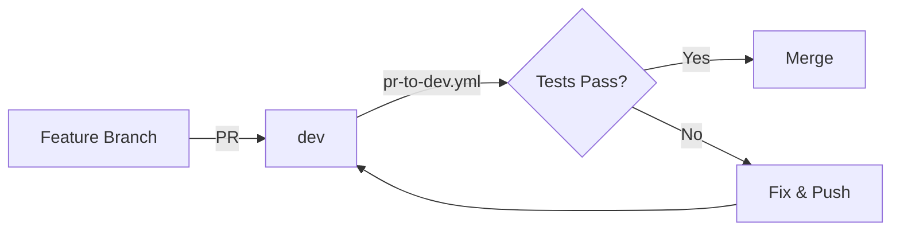
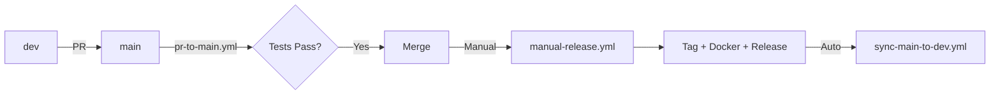

# Índice de Workflows CI/CD

**Última actualización**: 9 de noviembre de 2025  
**Versión**: 2.0 (Simplificado)

---

## 📋 Workflows Activos

### 1. PR a Dev - Tests Rápidos

**Archivo**: `pr-to-dev.yml`

**Cuándo se ejecuta**:
- Al abrir PR de feature branch → `dev`
- Al actualizar PR existente

**Qué hace**:
- ✅ Tests Unitarios (~5s)
- ✅ Lint & Format (~30s)
- ✅ Verificación de cobertura (>= 33%)
- ✅ Comentario automático en PR

**Tiempo**: ~2-3 minutos

**Uso**:
```bash
# Automático al crear PR
git push origin feature/nueva-funcionalidad
# Crear PR en GitHub: feature/nueva-funcionalidad → dev
```

---

### 2. PR a Main - Tests Completos

**Archivo**: `pr-to-main.yml`

**Cuándo se ejecuta**:
- Al abrir PR de `dev` → `main`
- Al actualizar PR existente

**Qué hace**:
- ✅ Tests Unitarios (~5s)
- ✅ Tests de Integración (~1-2 min)
- ✅ Lint & Format (~30s)
- ✅ Security Scan (~30s)
- ✅ Verificación de cobertura (>= 33%)
- ✅ Comentario detallado en PR

**Tiempo**: ~3-4 minutos

**Uso**:
```bash
# Automático al crear PR
# En GitHub: dev → main
```

---

### 3. Manual Release - Release Completo

**Archivo**: `manual-release.yml`

**Cuándo se ejecuta**:
- **Solo manualmente** desde GitHub Actions UI

**Qué hace**:
1. Crear tag de versión
2. Actualizar CHANGELOG.md
3. Ejecutar tests completos
4. Build imagen Docker (multi-platform)
5. Publicar en GitHub Container Registry
6. Crear GitHub Release con notas

**Tiempo**: ~10-15 minutos

**Uso**:
```
1. Ir a: Actions → Manual Release → Run workflow
2. Ingresar versión (ej: 0.1.0)
3. Seleccionar tipo: patch/minor/major
4. Click "Run workflow"
```

**Inputs**:
- `version`: Versión sin 'v' (ej: 0.1.0)
- `bump_type`: patch | minor | major

**Outputs**:
- Tag: `v0.1.0`
- Docker: `ghcr.io/edugogroup/edugo-api-mobile:v0.1.0`
- GitHub Release con changelog

---

### 4. Tests Manuales

**Archivo**: `test.yml`

**Cuándo se ejecuta**:
- **Solo manualmente** desde GitHub Actions UI

**Qué hace**:
- Ejecutar tests on-demand
- Elegir tipo: unit | integration | all

**Tiempo**: Variable según tipo

**Uso**:
```
1. Ir a: Actions → Tests with Coverage (Manual) → Run workflow
2. Seleccionar tipo de tests
3. Configurar umbral de cobertura (opcional)
4. Click "Run workflow"
```

**Inputs**:
- `test_type`: unit | integration | all
- `coverage_threshold`: Número (default: 33)
- `skip_coverage_check`: Boolean

---

### 5. Sync Main to Dev

**Archivo**: `sync-main-to-dev.yml`

**Cuándo se ejecuta**:
- Automáticamente después de push a `main`
- Después de merge de PR a `main`
- Después de `manual-release.yml`

**Qué hace**:
- Sincroniza cambios de `main` → `dev`
- Mantiene `dev` actualizado

**Tiempo**: ~30 segundos

**Uso**:
```bash
# Automático - no requiere acción manual
```

---

## 🗂️ Estructura de Workflows

```
.github/workflows/
├── pr-to-dev.yml           # PR a dev (tests rápidos)
├── pr-to-main.yml          # PR a main (tests completos)
├── manual-release.yml      # Release manual (on-demand)
├── test.yml                # Tests manuales
├── sync-main-to-dev.yml    # Sync automático
└── docs/                   # Documentación
    ├── WORKFLOWS_INDEX.md          # Este archivo
    ├── CI_CD_STRATEGY.md           # Estrategia general
    ├── WORKFLOW_DIAGRAM.md         # Diagramas visuales
    ├── SIMPLIFICATION_PLAN.md      # Plan de simplificación
    ├── TESTING_STRATEGY.md         # Estrategia de testing
    └── TROUBLESHOOTING.md          # Resolución de problemas
```

---

## 🔄 Flujos de Trabajo

### Desarrollo de Feature



**Pasos**:
1. Crear feature branch desde `dev`
2. Desarrollar y commit
3. Push y crear PR a `dev`
4. `pr-to-dev.yml` ejecuta tests (~2-3 min)
5. Si pasa, merge a `dev`

---

### Release a Producción



**Pasos**:
1. Crear PR de `dev` → `main`
2. `pr-to-main.yml` ejecuta tests completos (~3-4 min)
3. Si pasa, merge a `main`
4. **Manualmente** ejecutar `manual-release.yml`
5. Release completo se crea
6. `sync-main-to-dev.yml` sincroniza automáticamente

---

## 📊 Comparación de Workflows

| Workflow | Trigger | Tests | Docker | Release | Tiempo |
|----------|---------|-------|--------|---------|--------|
| pr-to-dev.yml | Auto (PR) | Unit | ❌ | ❌ | 2-3 min |
| pr-to-main.yml | Auto (PR) | Unit + Integration | ❌ | ❌ | 3-4 min |
| manual-release.yml | Manual | Unit + Integration | ✅ | ✅ | 10-15 min |
| test.yml | Manual | Configurable | ❌ | ❌ | Variable |
| sync-main-to-dev.yml | Auto (push) | ❌ | ❌ | ❌ | 30s |

---

## 🎯 Cuándo Usar Cada Workflow

### ¿Estás desarrollando una feature?
→ Usa `pr-to-dev.yml` (automático al crear PR)

### ¿Estás listo para release a producción?
→ Usa `pr-to-main.yml` (automático) + `manual-release.yml` (manual)

### ¿Quieres ejecutar tests sin PR?
→ Usa `test.yml` (manual)

### ¿Necesitas sincronizar branches?
→ Usa `sync-main-to-dev.yml` (automático)

---

## 🔐 Secrets Requeridos

| Secret | Descripción | Usado en |
|--------|-------------|----------|
| `GITHUB_TOKEN` | Token automático de GitHub | Todos |
| `APP_ID` | GitHub App ID | manual-release.yml |
| `APP_PRIVATE_KEY` | GitHub App Private Key | manual-release.yml |
| `CODECOV_TOKEN` | Token de Codecov (opcional) | pr-to-main.yml |

---

## 📈 Métricas de Performance

### Tests Unitarios
- **Cantidad**: 77 tests
- **Tiempo**: ~5 segundos
- **Cobertura**: 33.6%

### Tests de Integración
- **Cantidad**: 18 tests
- **Tiempo**: ~1-2 minutos (con contenedores compartidos)
- **Mejora**: 81.5% más rápido vs antes

### Workflows
- **PR a dev**: 70% más rápido vs antes
- **PR a main**: 60% más rápido vs antes
- **Workflows eliminados**: 7 (54% reducción)

---

## 🚀 Futuro: Release Automático

Cuando estemos listos para producción automática, crearemos:

**Archivo**: `auto-release-on-merge.yml`

```yaml
on:
  push:
    branches: [main]

jobs:
  trigger-release:
    steps:
      - name: Invoke manual-release.yml
        # Calcular versión automáticamente
        # Invocar manual-release.yml con inputs
```

**Beneficio**: Reutiliza `manual-release.yml` sin duplicar código

---

## 📚 Documentación Relacionada

- **[CI/CD Strategy](CI_CD_STRATEGY.md)** - Estrategia completa de CI/CD
- **[Workflow Diagrams](WORKFLOW_DIAGRAM.md)** - Diagramas visuales
- **[Simplification Plan](SIMPLIFICATION_PLAN.md)** - Plan de simplificación
- **[Testing Strategy](TESTING_STRATEGY.md)** - Estrategia de testing
- **[Troubleshooting](TROUBLESHOOTING.md)** - Resolución de problemas

---

## ❓ FAQ

### ¿Por qué no hay build automático de Docker?

Porque queremos control total sobre releases. El build de Docker solo ocurre cuando ejecutamos `manual-release.yml` manualmente.

### ¿Por qué tests de integración solo en PR a main?

Para velocidad. Los tests de integración tardan ~1-2 minutos. En PRs a dev (frecuentes), solo ejecutamos tests unitarios (~5s) para feedback rápido.

### ¿Cómo hago un hotfix?

1. Crear branch desde `main`: `hotfix/fix-critical-bug`
2. Fix y commit
3. PR a `main` (ejecuta `pr-to-main.yml`)
4. Merge
5. Ejecutar `manual-release.yml` con `bump_type: patch`
6. `sync-main-to-dev.yml` sincroniza automáticamente

### ¿Puedo ejecutar tests de integración en PR a dev?

Sí, manualmente:
1. Ir a Actions → Tests with Coverage (Manual)
2. Seleccionar `test_type: integration`
3. Run workflow

---

**Mantenido por**: Equipo de DevOps  
**Última revisión**: 9 de noviembre de 2025
