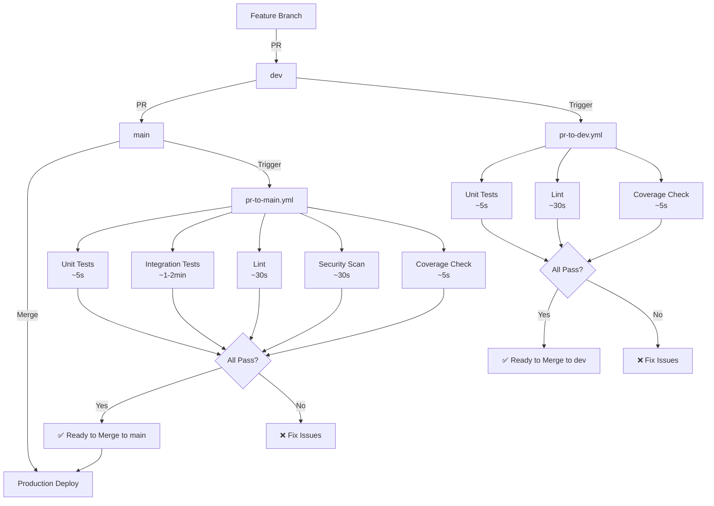

# Diagrama de Workflows CI/CD

## 🔄 Flujo Completo



## 📊 Comparación de Workflows

### PR a Dev (Feature → Dev)

```
┌─────────────────────────────────────────────────────────────┐
│  PR: feature/nueva-funcionalidad → dev                      │
├─────────────────────────────────────────────────────────────┤
│                                                              │
│  ┌──────────────┐  ┌──────────────┐  ┌──────────────┐     │
│  │ Unit Tests   │  │    Lint      │  │  Coverage    │     │
│  │   ~5 sec     │  │   ~30 sec    │  │   ~5 sec     │     │
│  │   77 tests   │  │              │  │   >= 33%     │     │
│  └──────────────┘  └──────────────┘  └──────────────┘     │
│                                                              │
│  Total: ~2-3 minutos                                        │
│                                                              │
│  ✅ Rápido para desarrollo iterativo                        │
└─────────────────────────────────────────────────────────────┘
```

### PR a Main (Dev → Main)

```
┌─────────────────────────────────────────────────────────────┐
│  PR: dev → main                                             │
├─────────────────────────────────────────────────────────────┤
│                                                              │
│  ┌──────────────┐  ┌──────────────┐  ┌──────────────┐     │
│  │ Unit Tests   │  │ Integration  │  │    Lint      │     │
│  │   ~5 sec     │  │   ~1-2 min   │  │   ~30 sec    │     │
│  │   77 tests   │  │   18 tests   │  │              │     │
│  └──────────────┘  └──────────────┘  └──────────────┘     │
│                                                              │
│  ┌──────────────┐  ┌──────────────┐                        │
│  │  Security    │  │  Coverage    │                        │
│  │   ~30 sec    │  │   ~5 sec     │                        │
│  │              │  │   >= 33%     │                        │
│  └──────────────┘  └──────────────┘                        │
│                                                              │
│  Total: ~3-4 minutos                                        │
│                                                              │
│  ✅ Completo para validación pre-producción                 │
└─────────────────────────────────────────────────────────────┘
```

## 🚀 Optimización de Tests de Integración

### Antes (Sin Contenedores Compartidos)

```
Test 1: Create Container → Run Test → Destroy Container  (~20s)
Test 2: Create Container → Run Test → Destroy Container  (~20s)
Test 3: Create Container → Run Test → Destroy Container  (~20s)
...
Test 18: Create Container → Run Test → Destroy Container (~20s)

Total: ~7 minutos 18 segundos
```

### Después (Con Contenedores Compartidos)

```
Setup: Create Containers (PostgreSQL, MongoDB, RabbitMQ)  (~12s)
  ↓
Test 1: Clean Data → Run Test  (~3s)
Test 2: Clean Data → Run Test  (~3s)
Test 3: Clean Data → Run Test  (~3s)
...
Test 18: Clean Data → Run Test (~3s)
  ↓
Teardown: Destroy Containers  (~6s)

Total: ~1 minuto 21 segundos

Mejora: 81.5% más rápido 🚀
```

## 📈 Timeline de Ejecución

### Desarrollo Típico (10 PRs por día)

```
ANTES:
PR 1: ████████ 8 min
PR 2: ████████ 8 min
PR 3: ████████ 8 min
...
Total: 80 minutos de espera por día

DESPUÉS:
PR 1: ██ 2 min (a dev)
PR 2: ██ 2 min (a dev)
PR 3: ██ 2 min (a dev)
...
PR 10: ████ 4 min (a main, 1 vez por día)
Total: 22 minutos de espera por día

Ahorro: 58 minutos por día = ~5 horas por semana
```

## 🎯 Estrategia de Branches

```
main (producción)
  ↑
  │ PR con tests completos
  │ (Unit + Integration + Security)
  │ ~3-4 minutos
  │
dev (staging)
  ↑
  │ PR con tests rápidos
  │ (Unit + Lint)
  │ ~2-3 minutos
  │
feature/nueva-funcionalidad
```

## 🔄 Ciclo de Vida de un Feature

```
1. Crear feature branch
   └─ git checkout -b feature/nueva-funcionalidad

2. Desarrollar
   └─ Commits frecuentes

3. PR a dev
   ├─ Trigger: pr-to-dev.yml
   ├─ Tests: Unit + Lint
   ├─ Tiempo: ~2-3 min
   └─ Merge si pasa

4. Testing en dev
   └─ QA manual/automático

5. PR a main
   ├─ Trigger: pr-to-main.yml
   ├─ Tests: Unit + Integration + Security
   ├─ Tiempo: ~3-4 min
   └─ Merge si pasa

6. Deploy a producción
   └─ Automático después de merge
```

## 📊 Métricas de Éxito

### Velocidad

```
┌─────────────────────────────────────────┐
│ Tiempo de Feedback                      │
├─────────────────────────────────────────┤
│ PR a dev:   ██ 2-3 min  (70% más rápido)│
│ PR a main:  ████ 3-4 min (60% más rápido)│
│ Antes:      ████████ 8-10 min           │
└─────────────────────────────────────────┘
```

### Confiabilidad

```
┌─────────────────────────────────────────┐
│ Cobertura de Tests                      │
├─────────────────────────────────────────┤
│ Unit Tests:        ████████ 77 tests    │
│ Integration Tests: ████ 18 tests        │
│ Coverage:          ███ 33.6%            │
└─────────────────────────────────────────┘
```

### Eficiencia

```
┌─────────────────────────────────────────┐
│ Uso de Recursos                         │
├─────────────────────────────────────────┤
│ Contenedores creados:                   │
│   Antes:  ████████████ 63 (21×3)       │
│   Después: █ 3 (reutilizados)           │
│   Reducción: 95% 🚀                     │
└─────────────────────────────────────────┘
```

## 🎨 Estados de PR

### PR a Dev

```
┌─────────────────────────────────────────┐
│ 🟢 All checks passed                    │
├─────────────────────────────────────────┤
│ ✅ Unit Tests (77 tests)                │
│ ✅ Lint & Format                        │
│ ✅ Coverage >= 33%                      │
│                                          │
│ Ready to merge to dev                   │
└─────────────────────────────────────────┘
```

### PR a Main

```
┌─────────────────────────────────────────┐
│ 🟢 All checks passed                    │
├─────────────────────────────────────────┤
│ ✅ Unit Tests (77 tests)                │
│ ✅ Integration Tests (18 tests)         │
│ ✅ Lint & Format                        │
│ ✅ Security Scan                        │
│ ✅ Coverage >= 33%                      │
│                                          │
│ Ready to merge to main 🚀               │
└─────────────────────────────────────────┘
```

---

**Última actualización**: 9 de noviembre de 2025

