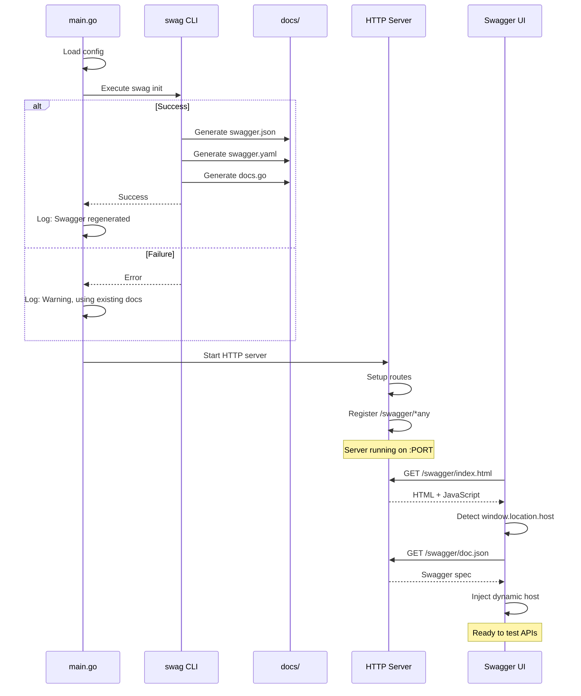
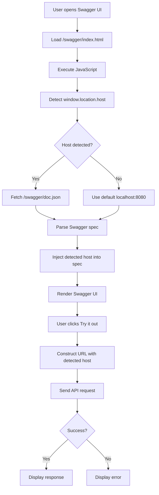

# Design Document: Swagger Dynamic Configuration

## Overview

Este diseño implementa una solución para automatizar la regeneración de documentación Swagger y configurar dinámicamente el host/puerto en Swagger UI. La solución se enfoca en tres áreas principales:

1. **Regeneración automática**: Ejecutar `swag init` al inicio de la aplicación
2. **Configuración dinámica**: Eliminar valores hardcodeados y usar detección en tiempo de ejecución
3. **Mejora de anotaciones**: Asegurar que todos los endpoints estén correctamente documentados

## Architecture

### Component Diagram

```
┌─────────────────────────────────────────────────────────────┐
│                      Application Startup                     │
│                                                               │
│  ┌──────────────┐      ┌─────────────────┐                 │
│  │   main.go    │─────▶│ Swagger         │                 │
│  │              │      │ Regeneration    │                 │
│  │              │      │ (swag init)     │                 │
│  └──────────────┘      └─────────────────┘                 │
│         │                       │                            │
│         │                       ▼                            │
│         │              ┌─────────────────┐                  │
│         │              │  docs/          │                  │
│         │              │  - docs.go      │                  │
│         │              │  - swagger.json │                  │
│         │              │  - swagger.yaml │                  │
│         │              └─────────────────┘                  │
│         │                                                    │
│         ▼                                                    │
│  ┌──────────────┐                                           │
│  │ HTTP Server  │                                           │
│  │ (Gin)        │                                           │
│  └──────────────┘                                           │
└─────────────────────────────────────────────────────────────┘
                          │
                          ▼
┌─────────────────────────────────────────────────────────────┐
│                      Runtime (Browser)                       │
│                                                               │
│  ┌──────────────────────────────────────────────────────┐   │
│  │              Swagger UI                               │   │
│  │                                                        │   │
│  │  ┌──────────────────────────────────────────────┐   │   │
│  │  │  Custom Swagger Config                       │   │   │
│  │  │  - Detect window.location.host               │   │   │
│  │  │  - Inject dynamic host into Swagger spec     │   │   │
│  │  └──────────────────────────────────────────────┘   │   │
│  │                                                        │   │
│  │  API Requests → http://{detected-host}/v1/...        │   │
│  └──────────────────────────────────────────────────────┘   │
└─────────────────────────────────────────────────────────────┘
```

## Components and Interfaces

### 1. Swagger Regeneration Module

**Location**: `cmd/main.go` (nueva función)

**Responsibility**: Ejecutar `swag init` antes de iniciar el servidor HTTP

**Interface**:
```go
// regenerateSwagger ejecuta swag init para actualizar la documentación
func regenerateSwagger(logger logger.Logger) error
```

**Implementation Details**:
- Usa `exec.Command` para ejecutar `swag init`
- Captura stdout/stderr para logging
- No bloquea el inicio si falla (solo registra warning)
- Se ejecuta antes de `router.SetupRouter()`

### 2. Dynamic Swagger Configuration

**Location**: `internal/infrastructure/http/router/swagger.go` (nuevo archivo)

**Responsibility**: Configurar Swagger UI con host dinámico

**Interface**:
```go
// SetupSwaggerUI configura Swagger UI con detección dinámica de host
func SetupSwaggerUI(r *gin.Engine)
```

**Implementation Details**:
- Sirve un HTML personalizado que inyecta JavaScript
- El JavaScript detecta `window.location.host` y lo inyecta en la configuración de Swagger
- Usa `ginSwagger.WrapHandler` con configuración personalizada
- Elimina dependencia de valores hardcodeados en anotaciones

### 3. Swagger Annotations Update

**Location**: Múltiples archivos de handlers

**Responsibility**: Asegurar documentación completa y correcta

**Files to Update**:
- `cmd/main.go`: Actualizar anotaciones globales
- Todos los handlers en `internal/infrastructure/http/handler/`

**Changes**:
- Remover `@host` hardcodeado
- Agregar anotaciones faltantes en handlers
- Estandarizar tags y descripciones
- Documentar todos los parámetros y respuestas

## Data Models

### Swagger Configuration Structure

```go
// SwaggerConfig representa la configuración de Swagger
type SwaggerConfig struct {
    Title       string
    Description string
    Version     string
    BasePath    string
    // Host se detecta dinámicamente, no se configura aquí
}
```

### Swagger UI Custom Config (JavaScript)

```javascript
const swaggerConfig = {
  url: "/swagger/doc.json",
  dom_id: '#swagger-ui',
  deepLinking: true,
  presets: [
    SwaggerUIBundle.presets.apis,
    SwaggerUIStandalonePreset
  ],
  plugins: [
    SwaggerUIBundle.plugins.DownloadUrl
  ],
  layout: "StandaloneLayout",
  // Inyectar host dinámico
  onComplete: function() {
    const host = window.location.host;
    // Actualizar todas las URLs de la spec con el host detectado
  }
}
```

## Error Handling

### Swagger Regeneration Errors

**Scenario**: `swag init` falla al ejecutarse

**Handling**:
1. Capturar error del comando
2. Registrar warning con detalles del error
3. Continuar con el inicio de la aplicación usando docs existentes
4. No fallar el startup completo

**Logging**:
```go
appLogger.Warn("no se pudo regenerar Swagger, usando documentación existente",
    zap.Error(err),
    zap.String("stderr", stderr),
)
```

### Missing Swagger Binary

**Scenario**: `swag` no está instalado en el sistema

**Handling**:
1. Detectar error "executable file not found"
2. Registrar mensaje informativo sugiriendo instalación
3. Continuar sin regeneración

**Logging**:
```go
appLogger.Info("swag no encontrado, omitiendo regeneración. Instalar con: go install github.com/swaggo/swag/cmd/swag@latest")
```

## Testing Strategy

### Unit Tests

**File**: `cmd/main_test.go`

**Tests**:
1. `TestRegenerateSwagger_Success`: Verifica ejecución exitosa de swag init
2. `TestRegenerateSwagger_CommandNotFound`: Verifica manejo cuando swag no existe
3. `TestRegenerateSwagger_CommandFails`: Verifica manejo de errores de ejecución

**Mocking**: Usar interfaces para mockear `exec.Command`

### Integration Tests

**File**: `test/integration/swagger_test.go`

**Tests**:
1. `TestSwaggerUI_DynamicHost`: Verifica que Swagger UI carga correctamente
2. `TestSwaggerUI_HealthEndpoint`: Verifica que /health se puede invocar desde Swagger UI
3. `TestSwaggerDocs_Generated`: Verifica que docs/ contiene archivos actualizados

### Manual Testing

**Checklist**:
1. ✅ Iniciar app en puerto 8080, verificar Swagger UI funciona
2. ✅ Iniciar app en puerto 3000, verificar Swagger UI funciona
3. ✅ Cambiar puerto en config, verificar URLs se actualizan
4. ✅ Invocar /health desde Swagger UI, verificar respuesta exitosa
5. ✅ Invocar endpoint protegido con Bearer token desde Swagger UI
6. ✅ Verificar que docs/ se regenera al iniciar la app

## Implementation Notes

### Swagger Annotations Best Practices

1. **Global annotations** (en `main.go`):
   - `@title`, `@version`, `@description`
   - `@contact`, `@license`
   - `@BasePath` (mantener `/v1`)
   - **NO incluir** `@host` (será dinámico)
   - `@securityDefinitions.apikey` para Bearer auth

2. **Handler annotations**:
   - `@Summary`: Descripción corta
   - `@Description`: Descripción detallada
   - `@Tags`: Agrupar endpoints relacionados
   - `@Accept` y `@Produce`: Tipos de contenido
   - `@Param`: Documentar todos los parámetros
   - `@Success` y `@Failure`: Documentar respuestas
   - `@Security`: Para endpoints protegidos

3. **DTO annotations**:
   - Usar `example` tags en structs
   - Documentar campos requeridos con `binding:"required"`
   - Incluir descripciones en comentarios

### Git Workflow

**Branch Strategy**:
1. Crear rama desde `dev`: `git checkout -b feature/swagger-dynamic-config`
2. Implementar cambios en la rama feature
3. Ejecutar tests y validaciones
4. Crear Pull Request hacia `dev`
5. **NUNCA** trabajar directamente en `dev`

**Commit Strategy**:
- Commits atómicos por componente
- Mensajes descriptivos siguiendo convención
- Ejemplo: `feat(swagger): add automatic regeneration on startup`

### Dependencies

**Required**:
- `github.com/swaggo/swag` (CLI tool)
- `github.com/swaggo/gin-swagger`
- `github.com/swaggo/files`

**Installation**:
```bash
go install github.com/swaggo/swag/cmd/swag@latest
```

### Configuration Changes

**No changes needed** en archivos de configuración YAML. La detección de puerto es automática desde `cfg.Server.Port`.

## Design Decisions

### Decision 1: Regeneración automática vs Manual

**Chosen**: Regeneración automática en startup

**Rationale**:
- Garantiza que docs siempre estén actualizados
- Elimina paso manual del desarrollador
- Overhead mínimo (1-2 segundos en startup)
- Falla gracefully si swag no está disponible

**Alternatives Considered**:
- Pre-commit hook: Requiere configuración adicional
- CI/CD only: No ayuda en desarrollo local

### Decision 2: Host dinámico via JavaScript vs Server-side

**Chosen**: Detección client-side con JavaScript

**Rationale**:
- Swagger UI ya corre en el browser
- `window.location.host` siempre refleja el host correcto
- No requiere cambios en el servidor
- Funciona con proxies y port forwarding

**Alternatives Considered**:
- Template rendering server-side: Más complejo, requiere custom handler
- Environment variables: No funciona con cambios dinámicos

### Decision 3: Continuar startup si swag falla

**Chosen**: Log warning y continuar

**Rationale**:
- Docs existentes siguen siendo útiles
- No bloquear desarrollo por problema de documentación
- Desarrollador puede regenerar manualmente si necesita

**Alternatives Considered**:
- Fallar startup: Demasiado restrictivo
- Silenciar error: Dificulta debugging

## Diagrams

### Sequence Diagram: Application Startup with Swagger Regeneration



### Flow Diagram: Swagger UI Dynamic Host Detection



## Security Considerations

1. **Swagger UI en producción**: Considerar deshabilitar o proteger con autenticación
2. **Información sensible**: No incluir secrets o tokens en ejemplos
3. **CORS**: Asegurar que CORS permite requests desde Swagger UI
4. **Rate limiting**: Aplicar también a requests desde Swagger UI

## Performance Considerations

1. **Startup time**: `swag init` agrega ~1-2 segundos al startup
2. **Caching**: Swagger UI cachea el spec, considerar cache headers
3. **File size**: swagger.json puede ser grande, considerar compresión
4. **Concurrent requests**: Swagger UI puede hacer múltiples requests simultáneos

## Monitoring and Observability

**Metrics to track**:
- Tiempo de regeneración de Swagger
- Errores en regeneración
- Requests a /swagger/* endpoints
- Errores 404 en Swagger UI

**Logging**:
- Log exitoso de regeneración con timestamp
- Log warnings si regeneración falla
- Log info sobre configuración de Swagger UI
