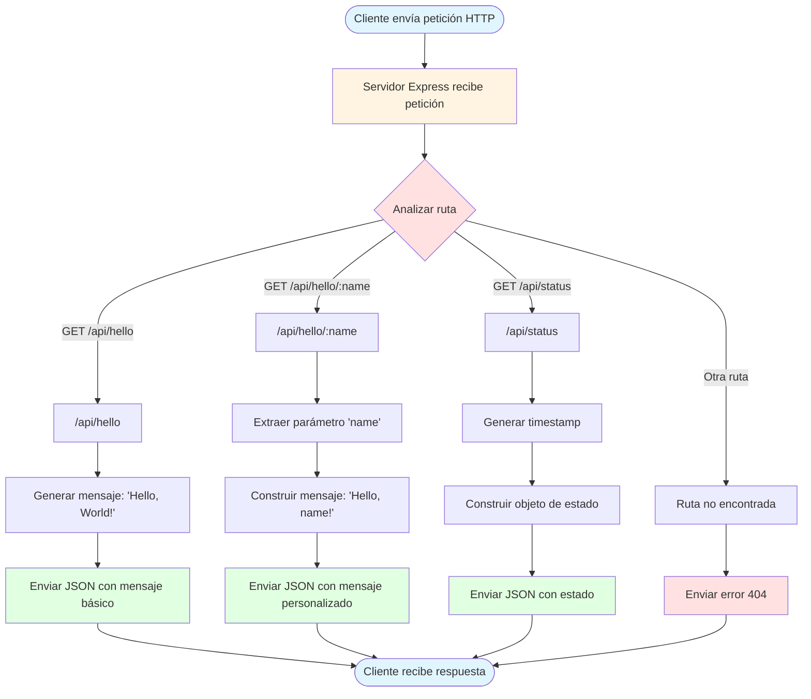
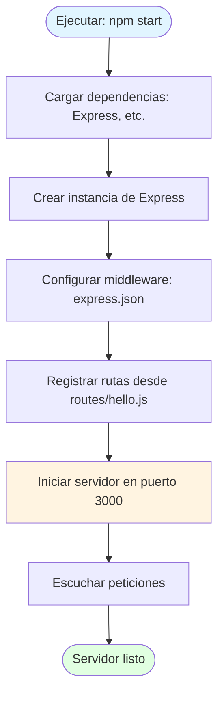
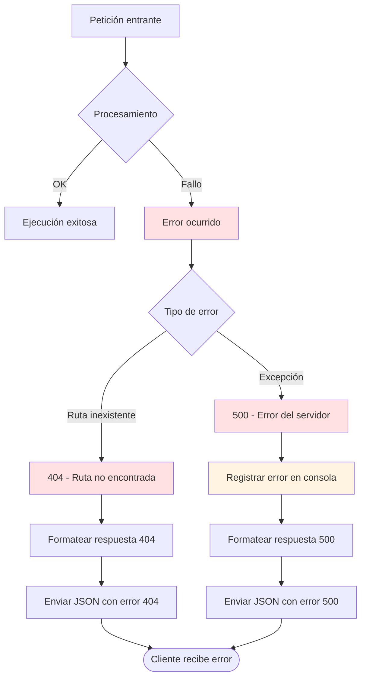
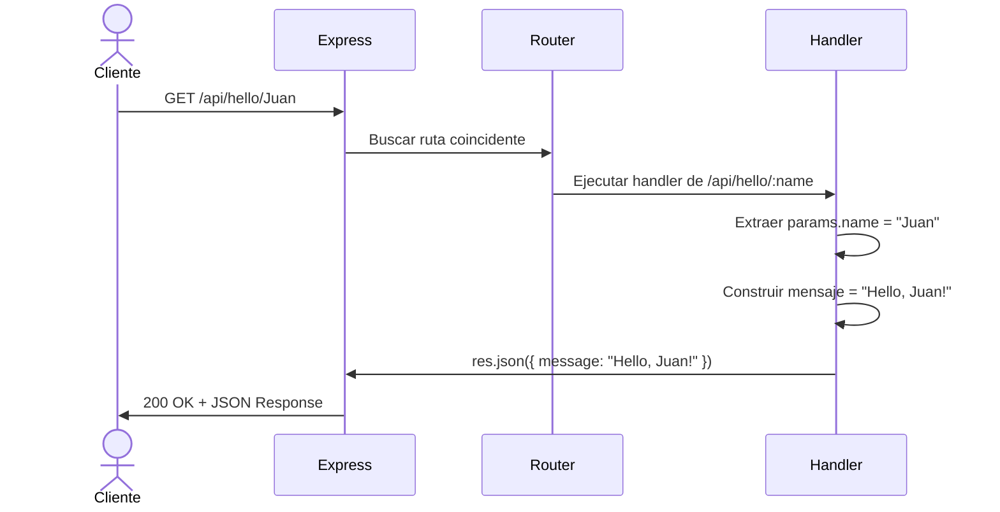

# Flujo de Procesos

## Descripción General

El sistema implementa un flujo de procesamiento HTTP simple basado en el patrón Request-Response. Cada petición del cliente pasa por el router de Express, se procesa según la ruta solicitada, y retorna una respuesta JSON.

El flujo es **stateless** (sin estado), lo que significa que cada petición es independiente y no requiere información de peticiones anteriores. No hay sesiones, autenticación, ni persistencia de datos.

## Proceso Principal: Manejo de Peticiones HTTP



## Descripción del Flujo Principal

### 1. **Recepción de Petición**
- El cliente (curl, navegador, Postman) envía una petición HTTP GET
- El servidor Express escuchando en el puerto 3000 recibe la petición
- El middleware de parsing procesa la petición

### 2. **Análisis de Ruta (Routing)**
- Express Router examina la URL de la petición
- Compara con las rutas registradas: `/api/hello`, `/api/hello/:name`, `/api/status`
- Determina qué handler debe procesar la petición

### 3. **Procesamiento según Endpoint**

#### Caso A: GET /api/hello
- No requiere procesamiento de parámetros
- Genera objeto JSON con mensaje estático: `{ "message": "Hello, World!" }`
- Envía respuesta con código HTTP 200

#### Caso B: GET /api/hello/:name
- Extrae el parámetro `name` de la URL usando `req.params.name`
- Valida que el parámetro existe (Express garantiza esto si la ruta coincide)
- Construye mensaje personalizado: `"Hello, " + name + "!"`
- Genera objeto JSON: `{ "message": "Hello, {name}!" }`
- Envía respuesta con código HTTP 200

#### Caso C: GET /api/status
- Genera timestamp actual usando `new Date().toISOString()`
- Construye objeto JSON con estado: `{ "status": "ok", "timestamp": "..." }`
- Envía respuesta con código HTTP 200

#### Caso D: Ruta No Encontrada
- Si la ruta no coincide con ninguna registrada
- Express retorna error 404
- Opcionalmente, el middleware de errores formatea la respuesta: `{ "error": "Not Found" }`

### 4. **Envío de Respuesta**
- El servidor serializa el objeto JavaScript a JSON
- Agrega headers apropiados: `Content-Type: application/json`
- Envía la respuesta al cliente
- Cierra la conexión HTTP

### 5. **Recepción por el Cliente**
- El cliente recibe el JSON
- Procesa la respuesta según su lógica
- La transacción finaliza

## Flujo de Inicio del Servidor



### Descripción del Flujo de Inicio

1. **Ejecución del comando**: `node src/index.js` o `npm start`
2. **Carga de módulos**: Node.js importa Express y módulos custom
3. **Inicialización de Express**: Se crea la aplicación Express
4. **Configuración de middleware**: Se agrega `express.json()` para parsear JSON
5. **Registro de rutas**: Se importan y registran las rutas desde `routes/hello.js`
6. **Binding del puerto**: El servidor se enlaza al puerto 3000
7. **Estado listo**: El servidor está escuchando peticiones

**Tiempo esperado**: < 3 segundos (según requerimientos)

## Flujo de Manejo de Errores



### Tipos de Errores Manejados

#### Error 404 - Not Found
- **Causa**: El cliente solicita una ruta que no existe (ej: `/api/xyz`)
- **Respuesta**:
  ```json
  {
    "error": "Not Found",
    "message": "La ruta solicitada no existe"
  }
  ```
- **Código HTTP**: 404

#### Error 500 - Internal Server Error
- **Causa**: Excepción no capturada durante el procesamiento
- **Acciones**:
  1. Registrar el error en consola para debugging
  2. Evitar exponer stack trace al cliente
  3. Retornar mensaje genérico de error
- **Respuesta**:
  ```json
  {
    "error": "Internal Server Error",
    "message": "Ocurrió un error en el servidor"
  }
  ```
- **Código HTTP**: 500

## Puntos de Integración

### Cliente HTTP → Servidor Express
- **Protocolo**: HTTP/1.1
- **Formato**: JSON
- **Métodos permitidos**: GET (únicamente)
- **Puerto**: 3000
- **Host**: localhost (desarrollo)

### Express → Routes Module
- **Mecanismo**: `require()` y `app.use()`
- **Acoplamiento**: Bajo (módulos separados)
- **Extensibilidad**: Fácil agregar nuevas rutas sin modificar index.js

### Routes → Response Builder
- **Mecanismo**: `res.json()` de Express
- **Serialización**: Automática (JavaScript Object → JSON)
- **Headers**: Gestionados por Express automáticamente

## Diagrama de Secuencia: Petición Completa



## Optimizaciones de Performance

### Decisiones que mejoran el rendimiento:
1. **Sin I/O de disco**: Todas las respuestas se generan en memoria
2. **Sin consultas a BD**: Elimina latencia de red/disco
3. **Procesamiento mínimo**: Solo concatenación de strings y generación de timestamps
4. **Sin middleware pesado**: Solo JSON parser esencial
5. **Respuestas pequeñas**: JSON mínimo (< 100 bytes)

**Resultado esperado**: Tiempo de respuesta < 100ms (según requerimientos)

## Casos de Uso en Producción

Aunque este es un ejercicio de validación, el flujo es representativo de:
- APIs de salud/status en sistemas distribuidos
- Endpoints de prueba en entornos de desarrollo
- Servicios de echo/ping para monitoreo de red
- Prototipos rápidos de APIs REST

---

**Fecha de análisis**: 2025-10-31
**Versión de documento**: 1.0
**Complejidad del flujo**: Baja (ideal para validación)
