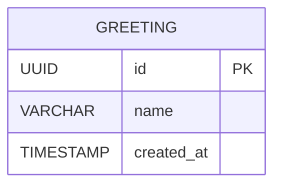

# Modelo de Datos

## Persistencia

Este proyecto **no requiere persistencia de datos**. Toda la información se maneja en memoria/estado temporal.

## Justificación

De acuerdo con los requerimientos del sprint, el sistema debe ser lo más simple posible para validar el flujo de desarrollo. Los endpoints implementados:

- **GET /api/hello** - Retorna un mensaje estático
- **GET /api/hello/:name** - Retorna un mensaje basado en el parámetro de ruta
- **GET /api/status** - Retorna el estado actual con timestamp generado dinámicamente

Ninguno de estos endpoints requiere:
- Almacenamiento de información entre peticiones
- Consultas a base de datos
- Persistencia de estado
- Relaciones entre entidades

## Estrategia de Manejo de Datos

### Datos de Entrada
- **Parámetro de ruta**: `name` en el endpoint `/api/hello/:name`
  - Tipo: String
  - Validación: Se acepta cualquier cadena (incluyendo caracteres Unicode)
  - Procesamiento: Se inserta directamente en el mensaje de respuesta

### Datos de Salida
Todas las respuestas son objetos JSON generados dinámicamente:

```javascript
// Endpoint /api/hello
{
  "message": "Hello, World!"
}

// Endpoint /api/hello/:name
{
  "message": "Hello, {name}!"
}

// Endpoint /api/status
{
  "status": "ok",
  "timestamp": "2025-10-31T14:30:00.000Z"
}
```

### Estado en Memoria
El único "estado" del sistema es:
- Timestamp actual generado con `new Date().toISOString()`
- Parámetros de ruta parseados por Express

## Consideraciones para Extensión Futura

Si este proyecto evolucionara hacia un sistema con persistencia, se recomendaría:

### Opción 1: SQLite
- Base de datos embebida
- Sin servidor adicional
- Ideal para desarrollo y pruebas

### Opción 2: PostgreSQL
- Si se requiere escalabilidad
- Soporte robusto de JSON
- Adecuado para producción

### Modelo de Datos Hipotético
Si se agregara persistencia, un modelo simple podría ser:



```sql
-- Tabla hipotética (NO implementada en este sprint)
CREATE TABLE greetings (
    id UUID PRIMARY KEY DEFAULT gen_random_uuid(),
    name VARCHAR(100) NOT NULL,
    created_at TIMESTAMP DEFAULT CURRENT_TIMESTAMP
);

CREATE INDEX idx_greetings_created_at ON greetings(created_at);
```

**Nota**: Este modelo es solo referencial y NO debe implementarse en el alcance actual del sprint.

## Conclusión

La ausencia de persistencia es una decisión arquitectónica deliberada que:
- ✅ Cumple con los requerimientos del sprint
- ✅ Reduce complejidad de implementación
- ✅ Acelera el desarrollo y testing
- ✅ Facilita la validación del flujo de comandos/agentes
- ✅ Elimina dependencias de infraestructura adicional

---

**Fecha de análisis**: 2025-10-31
**Versión de documento**: 1.0
**Estado de persistencia**: No aplica
