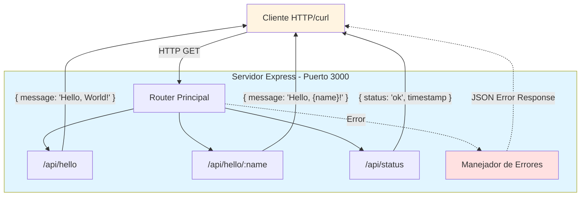

# Arquitectura del Sistema

## Resumen Ejecutivo

La arquitectura propuesta para este sprint es una **API REST minimalista basada en Node.js y Express.js**. El diseño prioriza la simplicidad y rapidez de implementación, enfocándose en validar el flujo completo del sistema de desarrollo sin agregar complejidad innecesaria.

Este sistema actúa como un servidor HTTP que expone tres endpoints REST para demostrar capacidades básicas de enrutamiento, manejo de parámetros y respuestas JSON. No requiere persistencia de datos ni autenticación, lo que simplifica significativamente la arquitectura y permite completar el desarrollo en un tiempo mínimo.

La arquitectura está optimizada para ser un ejercicio de validación técnica, proporcionando una base sólida para probar el flujo de comandos y agentes del sistema de desarrollo.

## Tipo de Arquitectura

**Monolítica Simple** - Aplicación de servidor único con arquitectura de capas básica (Routing Layer + Application Layer).

Esta elección se justifica por:
- Objetivo de validación rápida del flujo de desarrollo
- Alcance limitado del proyecto (3 endpoints)
- No requiere escalabilidad horizontal
- Minimiza overhead de configuración
- Ideal para demostraciones y pruebas de concepto

## Diagrama de Arquitectura



## Componentes Principales

### 1. Servidor Express (index.js)
- **Responsabilidad**:
  - Inicializar el servidor HTTP en el puerto 3000
  - Configurar middleware básico (JSON parser)
  - Registrar las rutas de la aplicación
  - Manejar el ciclo de vida del servidor

- **Tecnologías**:
  - Node.js (runtime)
  - Express.js v4.x (framework web)

- **Interacciones**:
  - Delega el manejo de rutas al módulo de routing
  - Escucha peticiones HTTP entrantes
  - Responde con JSON a los clientes

### 2. Router de Saludos (routes/hello.js)
- **Responsabilidad**:
  - Definir los endpoints `/api/hello` y `/api/hello/:name`
  - Procesar parámetros de ruta (name)
  - Construir respuestas JSON apropiadas
  - Validar entrada de datos (caracteres especiales, Unicode)

- **Tecnologías**:
  - Express Router
  - JavaScript ES6+

- **Interacciones**:
  - Se registra en el servidor principal
  - Responde directamente a peticiones HTTP GET
  - No requiere acceso a base de datos o servicios externos

### 3. Endpoint de Status (integrado en routes/hello.js o index.js)
- **Responsabilidad**:
  - Proveer información sobre el estado del servidor
  - Generar timestamp en formato ISO 8601
  - Confirmar disponibilidad del servicio

- **Tecnologías**:
  - JavaScript Date API

- **Interacciones**:
  - Endpoint independiente sin dependencias externas
  - Útil para health checks y monitoreo

### 4. Manejador de Errores
- **Responsabilidad**:
  - Capturar errores no manejados
  - Formatear respuestas de error en JSON
  - Evitar exposición de stack traces en producción

- **Tecnologías**:
  - Express error handling middleware

- **Interacciones**:
  - Se activa cuando hay excepciones en las rutas
  - Responde con códigos HTTP apropiados (404, 500, etc.)

## Patrones de Diseño Aplicados

### 1. **MVC Simplificado (Routing Layer Pattern)**
- **Descripción**: Separación de responsabilidades entre configuración del servidor (index.js) y definición de rutas (routes/hello.js)
- **Justificación**: Mantiene el código organizado y facilita la extensión futura de endpoints sin modificar el archivo principal

### 2. **Middleware Chain Pattern**
- **Descripción**: Uso de la cadena de middleware de Express para procesar peticiones (JSON parser → Router → Error Handler)
- **Justificación**: Patrón nativo de Express que proporciona flexibilidad y claridad en el flujo de procesamiento de requests

### 3. **RESTful Resource Pattern**
- **Descripción**: Diseño de endpoints siguiendo convenciones REST (GET para consultas, rutas descriptivas, respuestas JSON)
- **Justificación**: Estándar de la industria que facilita la comprensión y uso de la API

### 4. **Stateless Service Pattern**
- **Descripción**: El servidor no mantiene estado entre peticiones; cada request es independiente
- **Justificación**: Simplifica la implementación y permite escalabilidad horizontal si fuera necesario en el futuro

## Stack Tecnológico Recomendado

### Backend
- **Runtime**: Node.js v18 o superior (LTS)
- **Framework Web**: Express.js v4.18+
- **Parser**: express.json() middleware (integrado)
- **Gestión de Dependencias**: npm o yarn

### Frontend
- **No aplica** - Este proyecto es una API backend sin interfaz gráfica
- **Testing manual**: curl, Postman, o navegador web

### Base de datos
- **No aplica** - Sin persistencia de datos (requerimiento explícito)

### Infraestructura
- **Servidor local**: Desarrollo en localhost:3000
- **Sin contenedores** - Ejecución directa con Node.js
- **Sin balanceadores** - Instancia única suficiente para validación

### Herramientas de Desarrollo
- **Control de versiones**: Git
- **Linter**: ESLint (opcional)
- **Formato de código**: Prettier (opcional)

## Consideraciones No Funcionales

### Escalabilidad
- **Estrategia**: No requerida para este sprint
- **Capacidad**: Servidor single-thread adecuado para carga de prueba
- **Extensión futura**: Arquitectura permite migrar a cluster mode o PM2 si se requiere mayor throughput

### Seguridad
- **Nivel**: Mínimo - Este es un proyecto de validación sin datos sensibles
- **Medidas aplicadas**:
  - No hay autenticación (según requerimientos)
  - Entrada de parámetros debe sanitizarse para evitar injection
  - CORS puede configurarse si se requiere acceso desde navegador
- **No implementado** (fuera de alcance):
  - Rate limiting
  - HTTPS
  - Validación de tokens
  - Protección CSRF

### Performance
- **Objetivo**: Respuestas < 100ms (según requerimientos)
- **Optimizaciones**:
  - Sin operaciones de I/O (disco/base de datos)
  - Respuestas generadas en memoria
  - Sin procesamiento complejo
- **Tiempo de inicio**: < 3 segundos (según requerimientos)
- **Monitoreo**: Endpoint /api/status para health checks

### Mantenibilidad
- **Prácticas aplicadas**:
  - Código simple y legible
  - Separación clara de responsabilidades (index.js vs routes/)
  - Comentarios en código donde sea necesario
  - README con instrucciones claras de ejecución
- **Testing**:
  - Pruebas manuales con curl suficientes para este alcance
  - Tests automatizados opcionales (Jest/Mocha) si se extiende el proyecto

### Disponibilidad
- **SLA objetivo**: No crítico - Proyecto de validación
- **Recuperación ante fallos**: Reinicio manual del servidor
- **Logging**: Console.log para mensajes básicos de inicio y errores

## Estructura de Archivos Propuesta

```
proyecto/
├── src/
│   ├── index.js              # Punto de entrada y configuración del servidor
│   └── routes/
│       └── hello.js          # Definición de rutas de saludo y status
├── package.json              # Dependencias y scripts
├── .gitignore                # Exclusión de node_modules
└── README.md                 # Documentación de uso
```

## Decisiones Técnicas Clave

### ¿Por qué Express en lugar de Fastify o Koa?
- **Simplicidad**: Express es el framework más conocido y documentado
- **Rapidez de implementación**: Menos configuración inicial
- **Curva de aprendizaje**: Ideal para validación sin fricción

### ¿Por qué no usar TypeScript?
- **Alcance reducido**: JavaScript vanilla es suficiente para 3 endpoints
- **Velocidad**: Evita paso de compilación
- **Enfoque**: Validar flujo de desarrollo, no tecnología específica

### ¿Por qué no microservicios?
- **Overhead innecesario**: Complejidad no justificada para 3 endpoints
- **Objetivo del sprint**: Validación rápida, no diseño de producción
- **Mantenibilidad**: Monolito simple es más fácil de entender para demostraciones

---

**Fecha de análisis**: 2025-10-31
**Versión de documento**: 1.0
**Próximo paso**: Planificación de tareas de implementación
