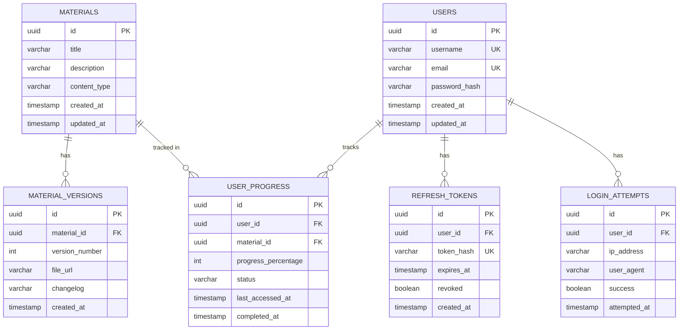

# Modelo de Datos - Fase 2: Completar TODOs de Servicios

**Alcance**: Fase 2 del sprint

## Estrategia de Persistencia

**Híbrido - Relacional (PostgreSQL) + NoSQL (MongoDB)** - Sin cambios en el esquema

La Fase 2 NO introduce nuevas tablas o colecciones. Se enfoca en **optimización de queries** sobre el esquema existente:
- **PostgreSQL**: Queries complejas con JOINs, CTEs, y UPSERT
- **MongoDB**: Aggregation pipelines para cálculos complejos

## Esquema Existente (Referencia)

### PostgreSQL - Entidades Principales



### MongoDB - Colecciones

**Colección: assessments**
```json
{
  "_id": "ObjectId",
  "material_id": "uuid-string",
  "title": "string",
  "questions": [
    {
      "question_id": "string",
      "question_text": "string",
      "question_type": "multiple_choice|true_false|open_ended",
      "options": ["string"],
      "correct_answer": "string|number"
    }
  ],
  "total_points": "number",
  "created_at": "ISODate",
  "updated_at": "ISODate"
}
```

**Colección: assessment_attempts**
```json
{
  "_id": "ObjectId",
  "assessment_id": "ObjectId",
  "user_id": "uuid-string",
  "answers": [
    {
      "question_id": "string",
      "user_answer": "string|number",
      "is_correct": "boolean",
      "points_earned": "number"
    }
  ],
  "total_score": "number",
  "max_score": "number",
  "percentage": "number",
  "feedback": "string",
  "started_at": "ISODate",
  "submitted_at": "ISODate"
}
```

## Queries Complejas a Implementar en Fase 2

### 1. Materials con Todas sus Versiones (PostgreSQL)

**Repository**: `MaterialRepositoryImpl.GetMaterialsWithVersions()`

**Query SQL**:
```sql
-- CTE para obtener materiales con metadatos agregados
WITH material_stats AS (
    SELECT 
        m.id,
        m.title,
        m.description,
        m.content_type,
        m.created_at,
        m.updated_at,
        COUNT(mv.id) as version_count,
        MAX(mv.version_number) as latest_version
    FROM materials m
    LEFT JOIN material_versions mv ON m.id = mv.material_id
    GROUP BY m.id
)
SELECT 
    ms.*,
    json_agg(
        json_build_object(
            'id', mv.id,
            'version_number', mv.version_number,
            'file_url', mv.file_url,
            'changelog', mv.changelog,
            'created_at', mv.created_at
        ) ORDER BY mv.version_number DESC
    ) as versions
FROM material_stats ms
LEFT JOIN material_versions mv ON ms.id = mv.material_id
GROUP BY ms.id, ms.title, ms.description, ms.content_type, 
         ms.created_at, ms.updated_at, ms.version_count, ms.latest_version
ORDER BY ms.updated_at DESC;
```

**Índices requeridos**:
```sql
CREATE INDEX idx_material_versions_material_id ON material_versions(material_id);
CREATE INDEX idx_material_versions_version_number ON material_versions(version_number);
CREATE INDEX idx_materials_updated_at ON materials(updated_at DESC);
```

**Resultado esperado**: Array de materiales con campo `versions` (JSON array)

---

### 2. Cálculo de Puntaje con Feedback (MongoDB)

**Repository**: `AssessmentRepositoryImpl.CalculateScoreWithFeedback()`

**Aggregation Pipeline**:
```javascript
[
  // Stage 1: Match el intento específico
  {
    $match: {
      _id: ObjectId("attempt_id")
    }
  },
  
  // Stage 2: Lookup del assessment original
  {
    $lookup: {
      from: "assessments",
      localField: "assessment_id",
      foreignField: "_id",
      as: "assessment"
    }
  },
  
  // Stage 3: Unwind assessment
  {
    $unwind: "$assessment"
  },
  
  // Stage 4: Proyección con cálculos
  {
    $project: {
      user_id: 1,
      assessment_id: 1,
      total_score: 1,
      max_score: "$assessment.total_points",
      percentage: {
        $multiply: [
          { $divide: ["$total_score", "$assessment.total_points"] },
          100
        ]
      },
      answers: 1,
      feedback: {
        $switch: {
          branches: [
            {
              case: { $gte: [{ $divide: ["$total_score", "$assessment.total_points"] }, 0.9] },
              then: "Excelente trabajo! Dominas el tema."
            },
            {
              case: { $gte: [{ $divide: ["$total_score", "$assessment.total_points"] }, 0.7] },
              then: "Buen trabajo! Sigue practicando."
            },
            {
              case: { $gte: [{ $divide: ["$total_score", "$assessment.total_points"] }, 0.5] },
              then: "Aprobado. Revisa los temas donde fallaste."
            }
          ],
          default: "Necesitas repasar el material."
        }
      },
      submitted_at: 1
    }
  }
]
```

**Índices requeridos**:
```javascript
db.assessment_attempts.createIndex({ assessment_id: 1 });
db.assessment_attempts.createIndex({ user_id: 1, submitted_at: -1 });
```

**Resultado esperado**: Documento con puntaje, porcentaje, y feedback generado

---

### 3. UPSERT de Progreso (PostgreSQL)

**Repository**: `ProgressRepositoryImpl.UpdateProgress()`

**Query SQL con UPSERT**:
```sql
INSERT INTO user_progress (
    id,
    user_id,
    material_id,
    progress_percentage,
    status,
    last_accessed_at,
    completed_at
)
VALUES (
    gen_random_uuid(),
    $1,  -- user_id
    $2,  -- material_id
    $3,  -- progress_percentage
    CASE 
        WHEN $3 >= 100 THEN 'completed'
        WHEN $3 > 0 THEN 'in_progress'
        ELSE 'not_started'
    END,
    NOW(),
    CASE WHEN $3 >= 100 THEN NOW() ELSE NULL END
)
ON CONFLICT (user_id, material_id)
DO UPDATE SET
    progress_percentage = GREATEST(user_progress.progress_percentage, EXCLUDED.progress_percentage),
    status = CASE 
        WHEN EXCLUDED.progress_percentage >= 100 THEN 'completed'
        WHEN EXCLUDED.progress_percentage > 0 THEN 'in_progress'
        ELSE user_progress.status
    END,
    last_accessed_at = NOW(),
    completed_at = CASE 
        WHEN EXCLUDED.progress_percentage >= 100 AND user_progress.completed_at IS NULL 
        THEN NOW() 
        ELSE user_progress.completed_at 
    END
RETURNING *;
```

**Índice UNIQUE requerido**:
```sql
CREATE UNIQUE INDEX idx_user_progress_user_material 
ON user_progress(user_id, material_id);
```

**Lógica del UPSERT**:
- Si registro NO existe → INSERT nuevo
- Si registro existe → UPDATE solo si nuevo progreso es MAYOR
- Status se actualiza automáticamente según porcentaje
- `completed_at` se establece solo la primera vez que llega a 100%

---

### 4. Estadísticas Agregadas (MongoDB)

**Repository**: `StatsRepositoryImpl.GetUserStatistics()`

**Aggregation Pipeline**:
```javascript
[
  // Stage 1: Match intentos del usuario
  {
    $match: {
      user_id: "uuid-string"
    }
  },
  
  // Stage 2: Lookup de assessments
  {
    $lookup: {
      from: "assessments",
      localField: "assessment_id",
      foreignField: "_id",
      as: "assessment"
    }
  },
  
  // Stage 3: Unwind
  {
    $unwind: "$assessment"
  },
  
  // Stage 4: Agrupar y calcular estadísticas
  {
    $group: {
      _id: "$user_id",
      total_attempts: { $sum: 1 },
      total_assessments: { $addToSet: "$assessment_id" },
      average_score: { $avg: "$percentage" },
      highest_score: { $max: "$percentage" },
      lowest_score: { $min: "$percentage" },
      total_points_earned: { $sum: "$total_score" },
      total_points_possible: { $sum: "$max_score" },
      attempts_by_assessment: {
        $push: {
          assessment_id: "$assessment_id",
          assessment_title: "$assessment.title",
          score: "$percentage",
          submitted_at: "$submitted_at"
        }
      }
    }
  },
  
  // Stage 5: Proyección final
  {
    $project: {
      user_id: "$_id",
      total_attempts: 1,
      unique_assessments_taken: { $size: "$total_assessments" },
      average_score: { $round: ["$average_score", 2] },
      highest_score: 1,
      lowest_score: 1,
      overall_percentage: {
        $round: [
          {
            $multiply: [
              { $divide: ["$total_points_earned", "$total_points_possible"] },
              100
            ]
          },
          2
        ]
      },
      recent_attempts: {
        $slice: [
          {
            $sortArray: {
              input: "$attempts_by_assessment",
              sortBy: { submitted_at: -1 }
            }
          },
          10  // Últimos 10 intentos
        ]
      }
    }
  }
]
```

**Índices requeridos**:
```javascript
db.assessment_attempts.createIndex({ user_id: 1, submitted_at: -1 });
db.assessments.createIndex({ _id: 1 });
```

**Resultado esperado**: Documento con estadísticas completas del usuario

---

## Optimizaciones de Performance

### PostgreSQL

**Índices compuestos**:
```sql
-- Para queries de progreso por usuario
CREATE INDEX idx_user_progress_user_status 
ON user_progress(user_id, status);

-- Para ordenamiento por fecha
CREATE INDEX idx_user_progress_last_accessed 
ON user_progress(last_accessed_at DESC);

-- Para JOINs eficientes
CREATE INDEX idx_material_versions_material_id_version 
ON material_versions(material_id, version_number DESC);
```

**VACUUM y ANALYZE**:
```sql
-- Ejecutar después de inserts masivos
VACUUM ANALYZE user_progress;
VACUUM ANALYZE material_versions;
```

### MongoDB

**Índices compuestos**:
```javascript
// Para queries de intentos por usuario + assessment
db.assessment_attempts.createIndex({ 
  user_id: 1, 
  assessment_id: 1, 
  submitted_at: -1 
});

// Para agregaciones
db.assessment_attempts.createIndex({ 
  user_id: 1, 
  percentage: -1 
});
```

**Projection en queries**:
```javascript
// Solo traer campos necesarios
db.assessment_attempts.find(
  { user_id: "uuid" },
  { answers: 0 }  // Excluir array de answers si no es necesario
);
```

---

## Estrategia de Testing de Queries

### Tests de Integración con Testcontainers

**PostgreSQL**:
```go
func TestMaterialRepository_GetMaterialsWithVersions(t *testing.T) {
    // Setup: Testcontainer PostgreSQL
    // Seed: 2 materiales, cada uno con 3 versiones
    // Execute: GetMaterialsWithVersions()
    // Assert: 
    //   - 2 materiales retornados
    //   - Cada material tiene array de 3 versiones
    //   - Versiones ordenadas DESC por version_number
}

func TestProgressRepository_UpdateProgress_Insert(t *testing.T) {
    // Setup: Testcontainer PostgreSQL
    // Seed: Usuario sin progreso en material X
    // Execute: UpdateProgress(userID, materialX, 50%)
    // Assert: 
    //   - Registro creado
    //   - status = "in_progress"
    //   - completed_at = NULL
}

func TestProgressRepository_UpdateProgress_UpdateWithHigherProgress(t *testing.T) {
    // Setup: Testcontainer PostgreSQL
    // Seed: Usuario con 50% en material X
    // Execute: UpdateProgress(userID, materialX, 75%)
    // Assert: 
    //   - progress_percentage = 75
    //   - last_accessed_at actualizado
}

func TestProgressRepository_UpdateProgress_IgnoreLowerProgress(t *testing.T) {
    // Setup: Testcontainer PostgreSQL
    // Seed: Usuario con 75% en material X
    // Execute: UpdateProgress(userID, materialX, 50%)
    // Assert: 
    //   - progress_percentage sigue siendo 75 (GREATEST)
}
```

**MongoDB**:
```go
func TestAssessmentRepository_CalculateScoreWithFeedback(t *testing.T) {
    // Setup: Testcontainer MongoDB
    // Seed: 1 assessment + 1 attempt (80% score)
    // Execute: CalculateScoreWithFeedback(attemptID)
    // Assert: 
    //   - percentage = 80
    //   - feedback = "Buen trabajo! Sigue practicando."
}

func TestStatsRepository_GetUserStatistics(t *testing.T) {
    // Setup: Testcontainer MongoDB
    // Seed: 5 intentos de 2 assessments diferentes
    // Execute: GetUserStatistics(userID)
    // Assert: 
    //   - total_attempts = 5
    //   - unique_assessments_taken = 2
    //   - average_score calculado correctamente
    //   - recent_attempts tiene 5 elementos ordenados
}
```

---

## Persistencia

Este componente **NO crea nuevas tablas ni colecciones**. Solo optimiza queries sobre el esquema existente.

**Resumen**:
- ✅ Esquema de datos ya existe (fases anteriores)
- ✅ Queries optimizadas con índices
- ✅ Lógica compleja encapsulada en repositorios
- ✅ Tests de integración con Testcontainers
