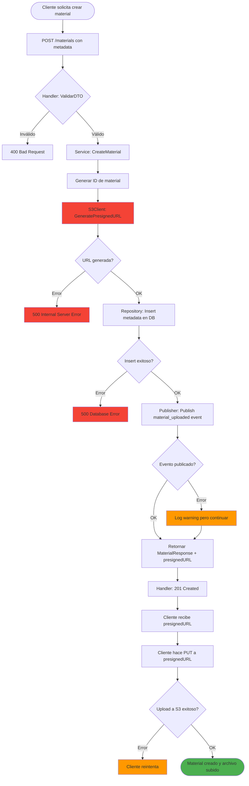
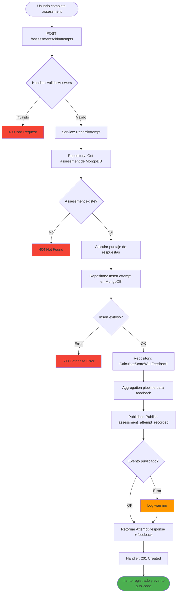
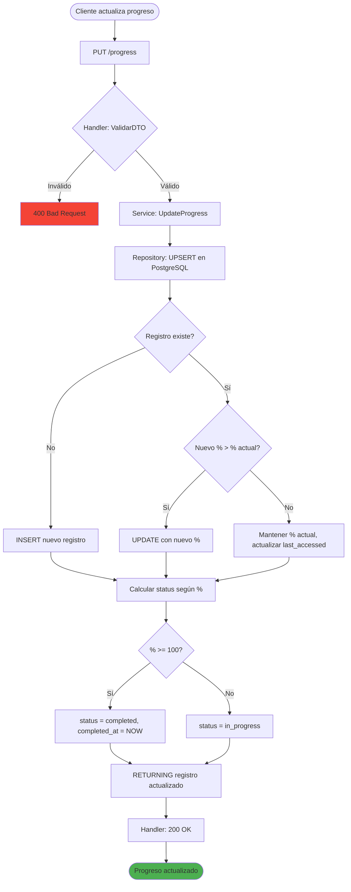
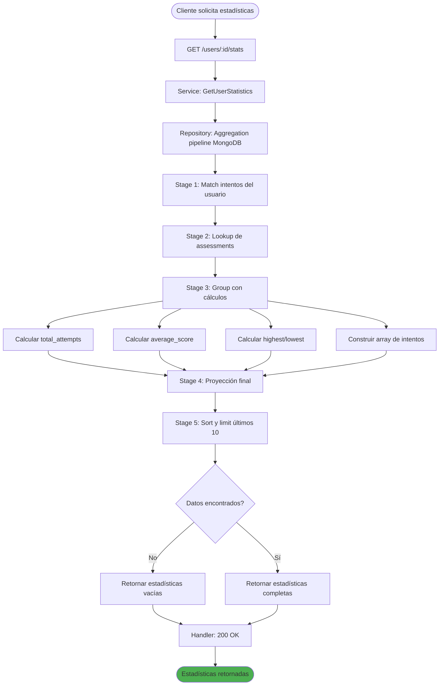
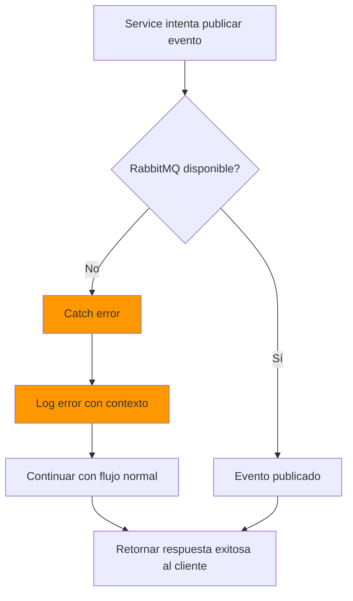
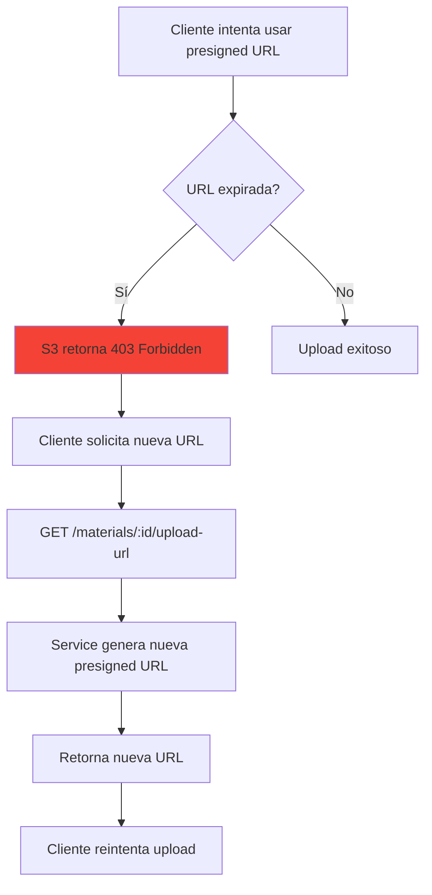
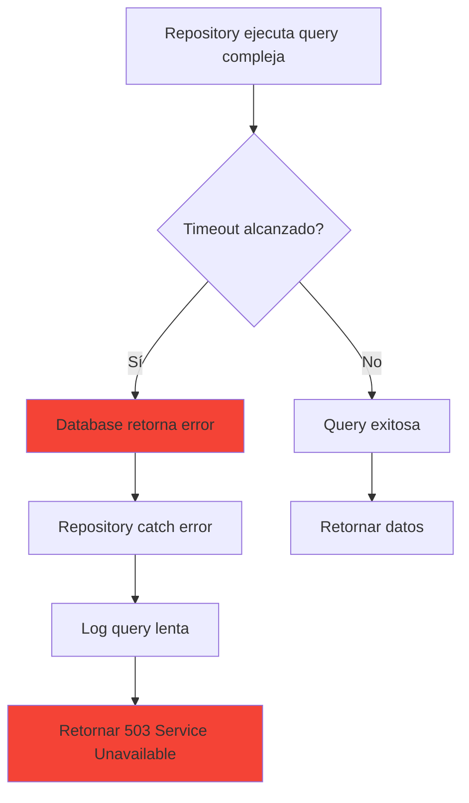

# Flujo de Procesos - Fase 2: Completar TODOs de Servicios

**Alcance**: Fase 2 del sprint

## Descripción General

La Fase 2 introduce tres nuevos flujos principales que extienden la funcionalidad existente:

1. **Flujo de Creación de Material con S3**: Upload directo de archivos a AWS S3 usando presigned URLs
2. **Flujo de Eventos con RabbitMQ**: Publicación de eventos de dominio a colas de mensajes
3. **Flujo de Consultas Complejas**: Recuperación optimizada de datos con agregaciones

Estos flujos se integran con la arquitectura existente sin modificar los contratos de las APIs.

---

## Proceso Principal: Creación de Material con S3 Upload



### Descripción del Flujo

1. **Validación de Input** (Handler)
   - Cliente envía metadata del material (título, descripción, tipo de contenido)
   - Handler valida DTO usando validaciones de Gin
   - Si inválido: retorna 400 Bad Request

2. **Generación de Presigned URL** (Service → S3Client)
   - Service genera UUID para el material
   - S3Client genera presigned URL con tiempo de expiración (15 min)
   - URL permite PUT directo al bucket S3
   - Si falla: retorna 500 Internal Server Error

3. **Persistencia de Metadata** (Service → Repository → PostgreSQL)
   - Inserta registro en tabla `materials` con metadata
   - NO guarda el archivo en este punto, solo la referencia
   - Si falla: retorna 500 Database Error

4. **Publicación de Evento** (Service → Publisher → RabbitMQ)
   - Publica evento `material_uploaded` a exchange
   - Payload: `{ material_id, title, content_type, uploaded_at }`
   - Si falla: **log warning pero NO falla la request** (evento no crítico)

5. **Respuesta al Cliente** (Handler)
   - Retorna 201 Created con:
     - Material ID
     - Metadata del material
     - **Presigned URL** para upload
   - Cliente tiene 15 minutos para usar la URL

6. **Upload Directo a S3** (Cliente → AWS S3)
   - Cliente hace PUT del archivo binario a la presigned URL
   - **Upload NO pasa por el backend** (reduce carga)
   - Si falla: cliente puede reintentar mientras URL sea válida

---

## Proceso Secundario: Registro de Intento de Assessment con Evento



### Descripción del Flujo

1. **Validación de Respuestas** (Handler)
   - Cliente envía array de respuestas: `[{ question_id, user_answer }]`
   - Handler valida que todas las preguntas estén respondidas

2. **Recuperación de Assessment** (Service → Repository → MongoDB)
   - Busca assessment por ID en MongoDB
   - Si no existe: retorna 404 Not Found

3. **Cálculo de Puntaje** (Service)
   - Itera sobre respuestas del usuario
   - Compara con `correct_answer` del assessment
   - Calcula `points_earned` y `total_score`

4. **Persistencia de Intento** (Service → Repository → MongoDB)
   - Inserta documento en colección `assessment_attempts`
   - Incluye respuestas, puntaje, timestamps

5. **Generación de Feedback** (Repository → MongoDB Aggregation)
   - Ejecuta aggregation pipeline para calcular:
     - Porcentaje de acierto
     - Feedback personalizado según rango de puntaje
     - Estadísticas del intento

6. **Publicación de Evento** (Service → Publisher → RabbitMQ)
   - Publica evento `assessment_attempt_recorded`
   - Payload: `{ attempt_id, user_id, assessment_id, score, submitted_at }`
   - Si falla: log warning (no crítico)

7. **Respuesta al Cliente** (Handler)
   - Retorna 201 Created con:
     - Attempt ID
     - Puntaje obtenido
     - Feedback generado
     - Respuestas correctas/incorrectas

---

## Proceso de Actualización de Progreso (UPSERT)



### Descripción del Flujo (UPSERT)

1. **Validación de Input** (Handler)
   - Cliente envía: `{ user_id, material_id, progress_percentage }`
   - Valida que porcentaje esté entre 0-100

2. **UPSERT en PostgreSQL** (Repository)
   - **Caso INSERT**: Si par (user_id, material_id) NO existe
     - Crea nuevo registro con porcentaje dado
     - Establece `status` según porcentaje
     - `completed_at` = NOW si porcentaje >= 100

   - **Caso UPDATE**: Si par ya existe
     - **Solo actualiza si nuevo % > % actual** (usa GREATEST)
     - Siempre actualiza `last_accessed_at`
     - Actualiza `status` si cambia
     - Establece `completed_at` solo si primera vez que llega a 100%

3. **Lógica de Status Automática**
   - `progress_percentage = 0` → `status = not_started`
   - `progress_percentage > 0 AND < 100` → `status = in_progress`
   - `progress_percentage >= 100` → `status = completed`

4. **Respuesta** (Handler)
   - Retorna 200 OK con registro actualizado
   - Cliente puede ver progreso actualizado

---

## Proceso de Consulta de Estadísticas (Aggregation)



### Descripción del Flujo (Aggregation)

1. **Request de Cliente** (Handler)
   - GET /users/:id/stats
   - No requiere body, solo user_id en path

2. **Aggregation Pipeline** (Repository → MongoDB)
   - **Stage 1 (Match)**: Filtra intentos del usuario
   - **Stage 2 (Lookup)**: Join con colección `assessments`
   - **Stage 3 (Group)**: Agrupa y calcula:
     - Total de intentos
     - Promedio de puntajes
     - Puntaje más alto/bajo
     - Lista de todos los intentos
   - **Stage 4 (Project)**: Formatea resultado final
   - **Stage 5 (Sort + Slice)**: Ordena por fecha y limita a últimos 10

3. **Respuesta** (Handler)
   - Retorna 200 OK con objeto de estadísticas:
     ```json
     {
       "user_id": "uuid",
       "total_attempts": 15,
       "unique_assessments_taken": 5,
       "average_score": 78.5,
       "highest_score": 95.0,
       "lowest_score": 60.0,
       "overall_percentage": 76.2,
       "recent_attempts": [...]
     }
     ```

---

## Flujos Alternativos/Excepcionales

### Caso: Fallo de RabbitMQ (Evento no crítico)



**Justificación**: Los eventos de RabbitMQ son **no críticos**. Si falla la publicación, la operación principal (crear material, registrar intento) debe continuar. El evento puede ser re-publicado por un job asíncrono posterior.

---

### Caso: Presigned URL Expirada



**Nota**: Requiere implementar endpoint adicional para regenerar URLs. Fuera del scope de Fase 2 inicial, pero recomendado para Fase 3.

---

### Caso: Query Compleja Lenta (Timeout)



**Mitigación**:
- Índices optimizados en PostgreSQL y MongoDB
- EXPLAIN ANALYZE para identificar queries lentas
- Paginación para limitar resultados
- Timeout configurado en 5 segundos

---

## Puntos de Integración

### Integración 1: AWS S3
- **Componente**: S3Client
- **Operación**: GeneratePresignedURL(fileName, contentType)
- **Timeout**: 10 segundos
- **Retry**: 2 intentos con backoff exponencial

### Integración 2: RabbitMQ
- **Componente**: RabbitMQPublisher
- **Operación**: Publish(exchange, routingKey, payload)
- **Timeout**: 5 segundos
- **Retry**: 1 intento (si falla, solo log)

### Integración 3: PostgreSQL (Queries Complejas)
- **Componente**: MaterialRepositoryImpl, ProgressRepositoryImpl
- **Operaciones**: GetMaterialsWithVersions, UpdateProgress (UPSERT)
- **Timeout**: 5 segundos
- **Indices**: Requeridos para performance (ver data-model-phase-2.md)

### Integración 4: MongoDB (Aggregations)
- **Componente**: AssessmentRepositoryImpl, StatsRepositoryImpl
- **Operaciones**: CalculateScoreWithFeedback, GetUserStatistics
- **Timeout**: 5 segundos
- **Indices**: Requeridos para aggregations eficientes

---

## Consideraciones de Performance

### Cuellos de Botella Potenciales
1. **Generación de Presigned URLs**: Llamada a AWS API (latencia variable)
   - Mitigación: Caché de cliente S3, timeout corto
2. **Aggregations MongoDB**: Pipelines complejas con múltiples stages
   - Mitigación: Índices compuestos, proyección de solo campos necesarios
3. **CTEs en PostgreSQL**: Queries con múltiples JOINs
   - Mitigación: EXPLAIN ANALYZE, índices optimizados

### Optimizaciones Implementadas
- **Publicación asíncrona de eventos**: No bloquea response HTTP
- **UPSERT en un solo query**: Evita SELECT + INSERT/UPDATE
- **Índices compuestos**: Optimizan JOINs y aggregations
- **Presigned URLs on-demand**: No se pre-generan, reducen carga

---

## Siguiente Paso

Ejecutar `/02-planning` para generar el plan de tareas detallado que implementa estos flujos.
