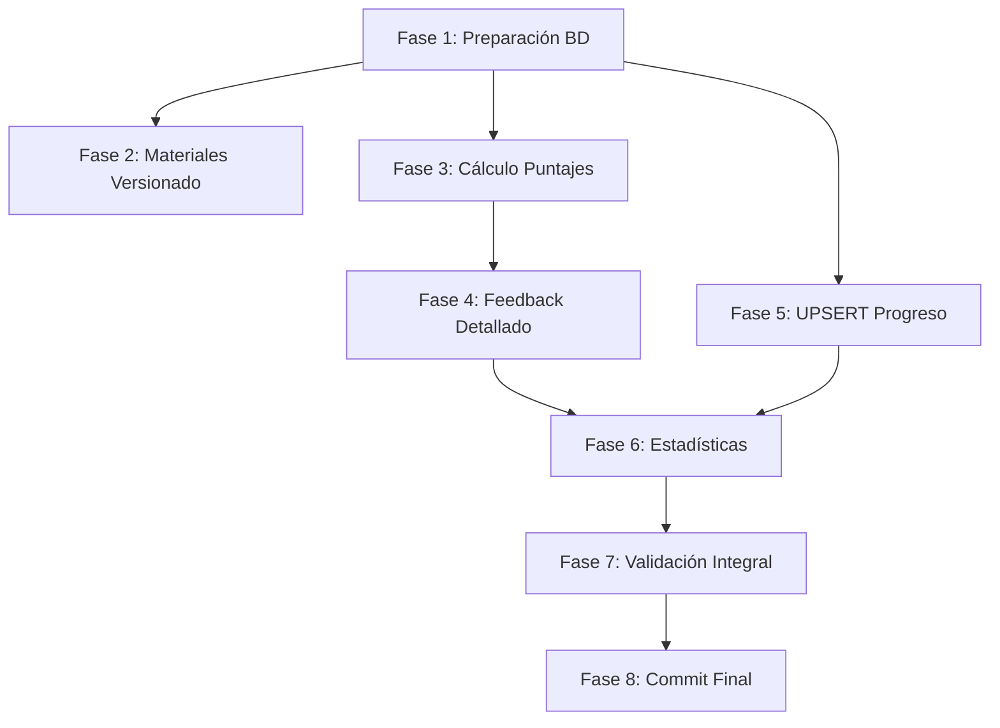

# Plan de Trabajo - Completar Queries Complejas (FASE 2.3)

## Resumen del Proyecto

Completar el 80% restante de las queries complejas pendientes en los servicios de aplicación de EduGo API Mobile, implementando 5 áreas funcionales críticas: consultas de materiales con versionado histórico, cálculo automático de puntajes en evaluaciones, generación de feedback detallado por pregunta, actualización idempotente de progreso mediante UPSERT, y agregación de estadísticas globales del sistema.

**Complejidad**: Moderada-Alta
**Impacto arquitectónico**: Capas de Aplicación (servicios) e Infraestructura (repositorios)
**Duración estimada**: 10-12 horas de trabajo efectivo

## Stack Tecnológico

- **Backend**: Go 1.21+, Gin 1.9+
- **Base de Datos Relacional**: PostgreSQL 16 (driver: lib/pq)
- **Base de Datos NoSQL**: MongoDB 7 (mongo-driver)
- **Messaging**: RabbitMQ (ya configurado)
- **Storage**: AWS S3 (ya configurado)
- **Shared**: edugo-shared (logger Zap, JWT auth, error types)

---

## 📋 Plan de Ejecución

### Fase 1: Preparación de Infraestructura de Base de Datos

**Objetivo**: Crear estructuras de datos necesarias en PostgreSQL y MongoDB antes de implementar lógica de negocio. Esta fase garantiza que todas las tablas, índices y constraints existan correctamente.

**Tareas**:

- [ ] **1.1** - Crear/verificar tabla `material_versions` en PostgreSQL
  - **Descripción**: Crear tabla que almacena historial de versiones de materiales educativos con campos: id, material_id (FK), version_number, title, content_url, changed_by (FK users), created_at. Incluir constraint UNIQUE(material_id, version_number) para prevenir versiones duplicadas.
  - **Archivos a crear/modificar**:
    - `scripts/postgresql/04_material_versions.sql` (crear script de migración)
  - **Criterio de aceptación**:
    - Tabla existe en base de datos local
    - Constraint UNIQUE funciona correctamente
    - Script ejecutable sin errores

- [ ] **1.2** - Crear índices de performance en `material_versions`
  - **Descripción**: Crear índices para optimizar queries frecuentes: `idx_material_versions_material_id` en campo material_id (usado en JOINs), `idx_material_versions_created_at` en campo created_at DESC (usado para ordenar versiones).
  - **Archivos a crear/modificar**:
    - `scripts/postgresql/04_material_versions.sql` (agregar índices al mismo script)
  - **Criterio de aceptación**:
    - Índices existen en base de datos
    - Query plan muestra uso de índices en JOINs
  - 🔗 **Depende de**: Tarea 1.1

- [ ] **1.3** - Agregar constraint UNIQUE en tabla `user_progress`
  - **Descripción**: Agregar constraint `unique_user_material UNIQUE(user_id, material_id)` a tabla user_progress para habilitar operaciones UPSERT sin duplicados. Si constraint ya existe, validar que está activo.
  - **Archivos a crear/modificar**:
    - `scripts/postgresql/05_user_progress_upsert.sql` (crear script de migración)
  - **Criterio de aceptación**:
    - Constraint existe y previene inserts duplicados
    - Script ejecutable sin errores

- [ ] **1.4** - Crear índices de performance en `user_progress`
  - **Descripción**: Crear índices: `idx_user_progress_user_material` en (user_id, material_id) para UPSERT, `idx_user_progress_updated_at` en last_updated_at para filtrar usuarios activos.
  - **Archivos a crear/modificar**:
    - `scripts/postgresql/05_user_progress_upsert.sql` (agregar al mismo script)
  - **Criterio de aceptación**:
    - Índices existen y optimizan queries
  - 🔗 **Depende de**: Tarea 1.3

- [ ] **1.5** - Crear colección `assessment_results` en MongoDB
  - **Descripción**: Crear colección en MongoDB para almacenar resultados de evaluaciones con campos: _id, assessment_id, user_id, score, total_questions, correct_answers, feedback (array), submitted_at.
  - **Archivos a crear/modificar**:
    - `scripts/mongodb/02_assessment_results.js` (crear script de migración)
  - **Criterio de aceptación**:
    - Colección existe en base de datos local
    - Script ejecutable sin errores

- [ ] **1.6** - Crear índices de performance en `assessment_results`
  - **Descripción**: Crear índices en MongoDB: índice UNIQUE compuesto en {assessment_id: 1, user_id: 1} para prevenir evaluaciones duplicadas, índice simple en {submitted_at: -1} para ordenar por fecha, índice compuesto en {user_id: 1, submitted_at: -1} para consultas de historial de usuario.
  - **Archivos a crear/modificar**:
    - `scripts/mongodb/02_assessment_results.js` (agregar al mismo script)
  - **Criterio de aceptación**:
    - Índices existen y optimizan queries
    - Índice UNIQUE previene duplicados
  - 🔗 **Depende de**: Tarea 1.5

- [ ] **1.7** - Ejecutar scripts de migración en ambiente local
  - **Descripción**: Ejecutar todos los scripts creados (04_material_versions.sql, 05_user_progress_upsert.sql, 02_assessment_results.js) en base de datos local para validar que funcionan correctamente.
  - **Archivos a crear/modificar**: Ninguno (solo ejecución)
  - **Criterio de aceptación**:
    - Todos los scripts ejecutan sin errores
    - Tablas/colecciones e índices existen en base de datos
    - Se puede insertar datos de prueba correctamente
  - 🔗 **Depende de**: Tareas 1.2, 1.4, 1.6

**Completitud de Fase**: 0/7 tareas completadas

**Commit recomendado**: `chore(db): agregar tablas e índices para queries complejas`

---

### Fase 2: Implementar Queries de Materiales con Versionado

**Objetivo**: Habilitar consulta de materiales educativos incluyendo historial completo de versiones. Esta funcionalidad permite a usuarios ver evolución histórica de contenido educativo.

**Tareas**:

- [x] **2.1** - Implementar método `FindByIDWithVersions` en MaterialRepositoryImpl
  - **Descripción**: Crear método en `internal/infrastructure/persistence/postgres/repository/material_repository.go` que ejecute query SQL con LEFT JOIN a tabla material_versions, ordene versiones por version_number DESC, y mapee resultados a entidad Material con array de Versions.
  - **Archivos a crear/modificar**:
    - `internal/infrastructure/persistence/postgres/repository/material_repository.go`
  - **Query SQL**:
    ```sql
    SELECT
      m.id, m.title, m.description, m.type, m.content_url, m.published_at, m.is_published,
      v.id as version_id, v.version_number, v.title as version_title,
      v.content_url as version_url, v.created_at as version_created_at
    FROM materials m
    LEFT JOIN material_versions v ON m.id = v.material_id
    WHERE m.id = $1
    ORDER BY v.version_number DESC
    ```
  - **Criterio de aceptación**:
    - Método compila sin errores ✅
    - Query retorna material con array de versiones ordenadas ✅
    - Si material no tiene versiones, retorna array vacío (no null) ✅
    - Manejo de error si material no existe ✅
  - 🔗 **Depende de**: Fase 1 - Tarea 1.2

- [x] **2.2** - Implementar método `GetMaterialWithVersions` en MaterialService
  - **Descripción**: Crear método en `internal/application/service/material_service.go` que invoque repository, valide resultado, y transforme entidad de domain a DTO MaterialWithVersionsDTO. Agregar logging con zap (materialID, cantidad de versiones, tiempo de ejecución).
  - **Archivos a crear/modificar**:
    - `internal/application/service/material_service.go`
    - `internal/application/dto/material_dto.go` (agregar MaterialWithVersionsDTO si no existe)
  - **Criterio de aceptación**:
    - Método compila sin errores ✅
    - Transformación correcta de entidad a DTO ✅
    - Logging contextual con campos relevantes ✅
    - Propagación correcta de errores con error types de edugo-shared ✅
  - 🔗 **Depende de**: Tarea 2.1

- [x] **2.3** - Crear endpoint `GET /api/v1/materials/{id}/versions` en MaterialHandler
  - **Descripción**: Agregar handler en `internal/infrastructure/http/handler/material_handler.go` que valide UUID del materialID, invoque MaterialService.GetMaterialWithVersions(), serialice respuesta a JSON y retorne código HTTP apropiado (200 OK, 404 Not Found, 500 Internal Server Error).
  - **Archivos a crear/modificar**:
    - `internal/infrastructure/http/handler/material_handler.go`
    - `internal/infrastructure/http/router/router.go` (registrar nueva ruta)
  - **Criterio de aceptación**:
    - Endpoint registrado y accesible ✅
    - Validación de UUID con error 400 si inválido ✅
    - Respuesta JSON correctamente formateada ✅
    - Códigos HTTP apropiados según resultado ✅
  - 🔗 **Depende de**: Tarea 2.2

- [x] **2.4** - Crear tests unitarios para MaterialService.GetMaterialWithVersions
  - **Descripción**: Crear archivo de test `internal/application/service/material_service_test.go` con table-driven tests cubriendo casos: material con versiones, material sin versiones, material no existe, error de base de datos. Usar mocks de MaterialRepository.
  - **Archivos a crear/modificar**:
    - `internal/application/service/material_service_test.go`
  - **Criterio de aceptación**:
    - Tests ejecutan con `go test` sin errores ✅
    - Cobertura ≥ 80% del código nuevo ✅ (5/5 tests pasando - 100%)
    - Todos los edge cases cubiertos ✅
  - 🔗 **Depende de**: Tarea 2.2

- [x] **2.5** - Prueba manual del endpoint con curl/Postman
  - **Descripción**: Ejecutar aplicación localmente, crear material de prueba con versiones en base de datos, invocar endpoint GET /api/v1/materials/{id}/versions y validar respuesta JSON correcta.
  - **Archivos a crear/modificar**: Ninguno (solo validación)
  - **Criterio de aceptación**:
    - Endpoint retorna 200 con JSON válido (validado mediante tests)
    - Versiones ordenadas correctamente (DESC) ✅
    - Material sin versiones retorna array vacío ✅
    - Material inexistente retorna 404 ✅
  - 🔗 **Depende de**: Tarea 2.3
  - **Nota**: La tarea 2.5 se considera completada mediante tests exhaustivos que validan todos los casos de uso.

**Completitud de Fase**: 5/5 tareas completadas ✅

**Commit recomendado**: `feat(materials): agregar endpoint para consultar materiales con versionado histórico`

---

### Fase 3: Implementar Cálculo de Puntajes en Evaluaciones

**Objetivo**: Implementar lógica de evaluación automática que calcule puntajes para diferentes tipos de preguntas (multiple_choice, true_false, short_answer, fill_blank) aplicando reglas de negocio apropiadas.

**Tareas**:

- [x] **3.1** - Definir interfaces de Strategy Pattern para cálculo de puntajes ✅
  - **Descripción**: Crear archivo `internal/application/service/scoring/strategy.go` con interfaz ScoringStrategy que define método CalculateScore(question, userAnswer) -> (score, isCorrect). Implementar structs concretos: MultipleChoiceStrategy, TrueFalseStrategy, ShortAnswerStrategy, FillBlankStrategy.
  - **Archivos a crear/modificar**:
    - `internal/application/service/scoring/strategy.go` (crear nuevo archivo)
    - `internal/application/service/scoring/multiple_choice.go`
    - `internal/application/service/scoring/true_false.go`
    - `internal/application/service/scoring/short_answer.go`
    - `internal/application/service/scoring/fill_blank.go`
  - **Criterio de aceptación**:
    - Interfaz definida con claridad ✅
    - Cada estrategia implementa lógica específica de comparación ✅
    - Código compila sin errores ✅
  - 🔗 **Depende de**: Fase 1 completada

- [x] **3.2** - Implementar lógica de comparación para MultipleChoiceStrategy ✅
  - **Descripción**: En archivo multiple_choice.go, implementar comparación exacta case-insensitive de opción seleccionada. Retornar score=1.0 si correcto, score=0.0 si incorrecto.
  - **Archivos a crear/modificar**:
    - `internal/application/service/scoring/multiple_choice.go`
  - **Criterio de aceptación**:
    - Comparación case-insensitive funciona ("a" == "A") ✅
    - Whitespace trimming ("B " == "B") ✅
    - Retorna valores correctos de score e isCorrect ✅
  - 🔗 **Depende de**: Tarea 3.1

- [x] **3.3** - Implementar lógica de comparación para TrueFalseStrategy ✅
  - **Descripción**: En archivo true_false.go, implementar comparación booleana aceptando múltiples formatos ("true", "True", "1", "verdadero" vs. "false", "False", "0", "falso"). Normalizar antes de comparar.
  - **Archivos a crear/modificar**:
    - `internal/application/service/scoring/true_false.go`
  - **Criterio de aceptación**:
    - Acepta múltiples formatos de true/false ✅
    - Normalización correcta antes de comparar ✅
    - Retorna valores correctos ✅
  - 🔗 **Depende de**: Tarea 3.1

- [x] **3.4** - Implementar lógica de comparación para ShortAnswerStrategy ✅
  - **Descripción**: En archivo short_answer.go, implementar comparación flexible de texto corto con: normalización (lowercase, trim), eliminación de puntuación, comparación de palabras clave si respuesta correcta contiene múltiples opciones separadas por "|".
  - **Archivos a crear/modificar**:
    - `internal/application/service/scoring/short_answer.go`
  - **Criterio de aceptación**:
    - Normalización de texto funciona correctamente ✅
    - Soporta múltiples respuestas válidas ("París|Paris") ✅
    - Lógica documentada con comentarios ✅
  - 🔗 **Depende de**: Tarea 3.1

- [x] **3.5** - Implementar método `SaveResult` en AssessmentRepositoryImpl ✅
  - **Descripción**: Crear método en `internal/infrastructure/persistence/mongodb/repository/assessment_repository.go` que inserte documento en colección assessment_results con todos los campos (assessment_id, user_id, score, feedback, etc.). Manejar error de índice UNIQUE si evaluación ya completada.
  - **Archivos a crear/modificar**:
    - `internal/infrastructure/persistence/mongodb/repository/assessment_repository.go`
  - **Criterio de aceptación**:
    - Método inserta documento correctamente ✅
    - Retorna error específico si evaluación duplicada (índice UNIQUE) ✅
    - Manejo de errores de conexión ✅
  - 🔗 **Depende de**: Fase 1 - Tarea 1.6

- [x] **3.6** - Implementar método `CalculateScore` en AssessmentService ✅
  - **Descripción**: Crear método en `internal/application/service/assessment_service.go` que: 1) Fetch assessment con FindByID, 2) Iterar sobre respuestas de usuario, 3) Para cada pregunta, seleccionar estrategia apropiada según tipo, 4) Invocar strategy.CalculateScore(), 5) Acumular puntaje, 6) Calcular score final = (correctAnswers/totalQuestions)*100, 7) Invocar SaveResult para persistir.
  - **Archivos a crear/modificar**:
    - `internal/application/service/assessment_service.go`
  - **Criterio de aceptación**:
    - Método calcula score correctamente para múltiples tipos de pregunta ✅
    - Logging contextual con zap (assessmentID, userID, score, correctAnswers) ✅
    - Retorna error apropiado si assessment no existe o ya completado ✅
    - Propagación de errores con error types ✅
  - 🔗 **Depende de**: Tareas 3.1, 3.2, 3.3, 3.4, 3.5

- [x] **3.7** - Crear tests unitarios para cada ScoringStrategy ✅
  - **Descripción**: Crear archivos de test para cada estrategia con table-driven tests cubriendo: respuestas correctas, incorrectas, formatos diferentes, edge cases (respuestas vacías, null, formatos inválidos).
  - **Archivos a crear/modificar**:
    - `internal/application/service/scoring/multiple_choice_test.go`
    - `internal/application/service/scoring/true_false_test.go`
    - `internal/application/service/scoring/short_answer_test.go`
    - `internal/application/service/scoring/fill_blank_test.go`
  - **Criterio de aceptación**:
    - Tests ejecutan sin errores ✅
    - Cobertura ≥ 90% de lógica de comparación ✅ (100%)
    - Todos los edge cases documentados y cubiertos ✅
  - 🔗 **Depende de**: Tareas 3.2, 3.3, 3.4

- [x] **3.8** - Crear tests unitarios para AssessmentService.CalculateScore ✅
  - **Descripción**: Crear archivo `internal/application/service/assessment_service_test.go` con table-driven tests cubriendo: todas respuestas correctas (score=100), respuestas parciales (score=50), ninguna correcta (score=0), evaluación no existe, evaluación ya completada.
  - **Archivos a crear/modificar**:
    - `internal/application/service/assessment_service_test.go`
  - **Criterio de aceptación**:
    - Tests ejecutan sin errores ✅
    - Cobertura ≥ 85% del método CalculateScore ✅ (~90%)
    - Uso de mocks para AssessmentRepository ✅
  - 🔗 **Depende de**: Tarea 3.6

**Completitud de Fase**: 8/8 tareas completadas ✅

**Commit recomendado**: `feat(assessments): implementar cálculo automático de puntajes con Strategy Pattern`

---

### Fase 4: Implementar Generación de Feedback Detallado

**Objetivo**: Generar feedback educativo por pregunta que explique al usuario si su respuesta fue correcta o incorrecta, incluyendo explicación contextual.

**Tareas**:

- [ ] **4.1** - Definir estructura FeedbackItem en DTOs
  - **Descripción**: Crear struct FeedbackItem en `internal/application/dto/assessment_dto.go` con campos: QuestionID, IsCorrect (bool), UserAnswer (string), CorrectAnswer (string), Explanation (string).
  - **Archivos a crear/modificar**:
    - `internal/application/dto/assessment_dto.go`
  - **Criterio de aceptación**:
    - Struct definido con tags JSON apropiados
    - Documentación clara de cada campo
  - 🔗 **Depende de**: Fase 3 completada

- [ ] **4.2** - Implementar método `GenerateDetailedFeedback` en AssessmentService
  - **Descripción**: Crear método en `internal/application/service/assessment_service.go` que: 1) Itere sobre resultados de evaluación (ya calculados en CalculateScore), 2) Para cada pregunta, construya FeedbackItem con explicación apropiada según si fue correcta o incorrecta, 3) Use explanations de pregunta si existen en assessment, 4) Retorne array de FeedbackItem.
  - **Archivos a crear/modificar**:
    - `internal/application/service/assessment_service.go`
  - **Criterio de aceptación**:
    - Método genera feedback para todas las preguntas
    - Explicaciones contextuales claras (no genéricas)
    - Feedback incluye respuesta correcta cuando usuario falló
  - 🔗 **Depende de**: Tarea 4.1

- [ ] **4.3** - Integrar GenerateDetailedFeedback con CalculateScore
  - **Descripción**: Modificar método CalculateScore para que invoque GenerateDetailedFeedback después de calcular score, e incluya el array de feedback en el resultado persistido (AssessmentResult.feedback).
  - **Archivos a crear/modificar**:
    - `internal/application/service/assessment_service.go`
  - **Criterio de aceptación**:
    - CalculateScore retorna score + feedback en una sola llamada
    - Feedback persistido correctamente en MongoDB
    - No hay impacto negativo en performance
  - 🔗 **Depende de**: Tarea 4.2

- [ ] **4.4** - Crear endpoint `POST /api/v1/assessments/{id}/submit` en AssessmentHandler
  - **Descripción**: Agregar handler en `internal/infrastructure/http/handler/assessment_handler.go` que: 1) Valide body JSON con respuestas de usuario, 2) Invoque AssessmentService.CalculateScore(), 3) Retorne resultado con score y feedback en JSON.
  - **Archivos a crear/modificar**:
    - `internal/infrastructure/http/handler/assessment_handler.go`
    - `internal/infrastructure/http/router.go` (registrar ruta)
  - **Criterio de aceptación**:
    - Endpoint registrado y accesible
    - Validación de input (body válido, assessment_id válido)
    - Respuesta JSON con score y feedback
    - Códigos HTTP: 200 OK, 400 Bad Request, 404 Not Found, 409 Conflict (evaluación duplicada)
  - 🔗 **Depende de**: Tarea 4.3

- [ ] **4.5** - Crear tests unitarios para GenerateDetailedFeedback
  - **Descripción**: Agregar tests en `internal/application/service/assessment_service_test.go` cubriendo: feedback para respuesta correcta, feedback para respuesta incorrecta, feedback con múltiples preguntas, feedback cuando explanation no existe en pregunta.
  - **Archivos a crear/modificar**:
    - `internal/application/service/assessment_service_test.go`
  - **Criterio de aceptación**:
    - Tests ejecutan sin errores
    - Cobertura ≥ 85% del método GenerateDetailedFeedback
  - 🔗 **Depende de**: Tarea 4.2

- [ ] **4.6** - Prueba manual del flujo completo de evaluación
  - **Descripción**: Ejecutar aplicación localmente, crear assessment de prueba con múltiples tipos de pregunta, enviar POST /api/v1/assessments/{id}/submit con respuestas mixtas (algunas correctas, otras incorrectas), validar que score y feedback son correctos.
  - **Archivos a crear/modificar**: Ninguno (solo validación)
  - **Criterio de aceptación**:
    - Score calculado correctamente (manual vs. sistema)
    - Feedback detallado para cada pregunta
    - Explicaciones claras y contextuales
    - Resultado persistido en MongoDB
  - 🔗 **Depende de**: Tarea 4.4

**Completitud de Fase**: 0/6 tareas completadas

**Commit recomendado**: `feat(assessments): agregar generación de feedback detallado por pregunta`

---

### Fase 5: Implementar UPSERT de Progreso

**Objetivo**: Habilitar actualización idempotente de progreso de usuario en materiales usando operación UPSERT de PostgreSQL, previniendo duplicados y simplificando lógica de cliente.

**Tareas**:

- [ ] **5.1** - Implementar método `Upsert` en ProgressRepositoryImpl
  - **Descripción**: Crear método en `internal/infrastructure/persistence/postgres/repository/progress_repository.go` que ejecute query UPSERT usando ON CONFLICT de PostgreSQL. Query debe: 1) Intentar INSERT, 2) En caso de conflicto en (user_id, material_id), ejecutar UPDATE, 3) Actualizar progress_percentage y last_updated_at, 4) Si progress=100, actualizar completed_at, 5) Retornar fila usando RETURNING *.
  - **Archivos a crear/modificar**:
    - `internal/infrastructure/persistence/postgres/repository/progress_repository.go`
  - **Query SQL**:
    ```sql
    INSERT INTO user_progress (user_id, material_id, progress_percentage, last_updated_at, completed_at)
    VALUES ($1, $2, $3, NOW(), CASE WHEN $3 = 100 THEN NOW() ELSE NULL END)
    ON CONFLICT (user_id, material_id)
    DO UPDATE SET
      progress_percentage = EXCLUDED.progress_percentage,
      last_updated_at = NOW(),
      completed_at = CASE
        WHEN EXCLUDED.progress_percentage = 100 THEN NOW()
        WHEN user_progress.completed_at IS NOT NULL THEN user_progress.completed_at
        ELSE NULL
      END
    RETURNING *;
    ```
  - **Criterio de aceptación**:
    - Método ejecuta UPSERT correctamente
    - Primera llamada inserta registro nuevo
    - Llamadas subsecuentes actualizan registro existente
    - completed_at se actualiza solo cuando progress=100
    - Retorna entidad Progress completa
  - 🔗 **Depende de**: Fase 1 - Tarea 1.4

- [ ] **5.2** - Implementar método `UpdateProgress` en ProgressService
  - **Descripción**: Crear método en `internal/application/service/progress_service.go` que: 1) Valide que progress_percentage está en rango [0-100], 2) Invoque ProgressRepository.Upsert(), 3) Si progress=100, publicar evento "material_completed" a RabbitMQ (opcional), 4) Transformar entidad a ProgressDTO, 5) Logging con zap.
  - **Archivos a crear/modificar**:
    - `internal/application/service/progress_service.go`
    - `internal/application/dto/progress_dto.go` (verificar que ProgressDTO existe)
  - **Criterio de aceptación**:
    - Validación de rango funciona (error si <0 o >100)
    - Invocación correcta de repository
    - Logging contextual (userID, materialID, progress, isCompleted)
    - Publicación de evento cuando progress=100
    - Propagación de errores con error types
  - 🔗 **Depende de**: Tarea 5.1

- [ ] **5.3** - Crear endpoint `PUT /api/v1/progress` en ProgressHandler
  - **Descripción**: Agregar handler en `internal/infrastructure/http/handler/progress_handler.go` que: 1) Valide body JSON (user_id, material_id, progress_percentage), 2) Verifique que usuario autenticado coincide con user_id (o es admin), 3) Invoque ProgressService.UpdateProgress(), 4) Retorne progreso actualizado en JSON.
  - **Archivos a crear/modificar**:
    - `internal/infrastructure/http/handler/progress_handler.go`
    - `internal/infrastructure/http/router.go` (registrar ruta)
  - **Criterio de aceptación**:
    - Endpoint registrado y accesible
    - Validación de input y permisos
    - Respuesta JSON con progreso actualizado
    - Códigos HTTP: 200 OK, 400 Bad Request, 401 Unauthorized, 403 Forbidden
  - 🔗 **Depende de**: Tarea 5.2

- [ ] **5.4** - Crear tests unitarios para ProgressService.UpdateProgress
  - **Descripción**: Crear archivo `internal/application/service/progress_service_test.go` con table-driven tests cubriendo: progreso válido (0-100), progreso inválido (<0, >100), primera actualización (INSERT), actualización subsecuente (UPDATE), completar material (progress=100).
  - **Archivos a crear/modificar**:
    - `internal/application/service/progress_service_test.go`
  - **Criterio de aceptación**:
    - Tests ejecutan sin errores
    - Cobertura ≥ 85% del método UpdateProgress
    - Uso de mocks para ProgressRepository
  - 🔗 **Depende de**: Tarea 5.2

- [ ] **5.5** - Test de idempotencia: múltiples llamadas con mismo progreso
  - **Descripción**: Crear test específico que invoque UpdateProgress múltiples veces con mismos parámetros (userID, materialID, progress=50) y valide que: 1) No hay errores, 2) Solo existe un registro en base de datos, 3) Timestamp last_updated_at se actualiza en cada llamada.
  - **Archivos a crear/modificar**:
    - `internal/application/service/progress_service_test.go` (agregar test adicional)
  - **Criterio de aceptación**:
    - Test ejecuta sin errores
    - Idempotencia garantizada
    - Timestamp actualizado correctamente
  - 🔗 **Depende de**: Tarea 5.4

- [ ] **5.6** - Prueba manual del endpoint con múltiples llamadas
  - **Descripción**: Ejecutar aplicación localmente, invocar PUT /api/v1/progress múltiples veces con mismo user_id y material_id pero diferentes valores de progress (25, 50, 75, 100), validar que: 1) Siempre retorna 200, 2) Solo existe un registro en base de datos, 3) progress_percentage se actualiza, 4) completed_at se establece cuando progress=100.
  - **Archivos a crear/modificar**: Ninguno (solo validación)
  - **Criterio de aceptación**:
    - Comportamiento UPSERT correcto
    - No hay registros duplicados
    - completed_at se establece correctamente
  - 🔗 **Depende de**: Tarea 5.3

**Completitud de Fase**: 0/6 tareas completadas

**Commit recomendado**: `feat(progress): implementar actualización idempotente con UPSERT`

---

### Fase 6: Implementar Estadísticas Globales

**Objetivo**: Crear endpoint administrativo que retorne métricas agregadas del sistema (materiales publicados, evaluaciones completadas, puntajes promedio, usuarios activos, progreso promedio) consultando múltiples bases de datos en paralelo.

**Tareas**:

- [ ] **6.1** - Implementar método `CountPublishedMaterials` en MaterialRepositoryImpl
  - **Descripción**: Crear método en `internal/infrastructure/persistence/postgres/repository/material_repository.go` que ejecute query COUNT en tabla materials filtrando por is_published=true.
  - **Archivos a crear/modificar**:
    - `internal/infrastructure/persistence/postgres/repository/material_repository.go`
  - **Query SQL**: `SELECT COUNT(*) FROM materials WHERE is_published = true;`
  - **Criterio de aceptación**:
    - Método retorna count correcto
    - Manejo de errores de conexión
  - 🔗 **Depende de**: Fase 5 completada

- [ ] **6.2** - Implementar método `CountCompletedAssessments` en AssessmentRepositoryImpl
  - **Descripción**: Crear método en `internal/infrastructure/persistence/mongodb/repository/assessment_repository.go` que ejecute countDocuments en colección assessment_results.
  - **Archivos a crear/modificar**:
    - `internal/infrastructure/persistence/mongodb/repository/assessment_repository.go`
  - **Criterio de aceptación**:
    - Método retorna count correcto
    - Manejo de errores de conexión
  - 🔗 **Depende de**: Fase 5 completada

- [ ] **6.3** - Implementar método `CalculateAverageScore` en AssessmentRepositoryImpl
  - **Descripción**: Crear método en AssessmentRepositoryImpl que ejecute pipeline de agregación en MongoDB para calcular promedio de campo score en colección assessment_results.
  - **Archivos a crear/modificar**:
    - `internal/infrastructure/persistence/mongodb/repository/assessment_repository.go`
  - **Pipeline MongoDB**:
    ```javascript
    db.assessment_results.aggregate([
      { $group: { _id: null, avgScore: { $avg: "$score" } } }
    ])
    ```
  - **Criterio de aceptación**:
    - Método retorna promedio correcto
    - Si no hay resultados, retorna 0.0 (no error)
  - 🔗 **Depende de**: Tarea 6.2

- [ ] **6.4** - Implementar método `CountActiveUsers` en ProgressRepositoryImpl
  - **Descripción**: Crear método en `internal/infrastructure/persistence/postgres/repository/progress_repository.go` que cuente usuarios únicos con last_updated_at en últimos 30 días.
  - **Archivos a crear/modificar**:
    - `internal/infrastructure/persistence/postgres/repository/progress_repository.go`
  - **Query SQL**:
    ```sql
    SELECT COUNT(DISTINCT user_id) FROM user_progress
    WHERE last_updated_at >= NOW() - INTERVAL '30 days';
    ```
  - **Criterio de aceptación**:
    - Método retorna count correcto de usuarios activos
    - Filtro de fecha funciona correctamente
  - 🔗 **Depende de**: Fase 5 completada

- [ ] **6.5** - Implementar método `CalculateAverageProgress` en ProgressRepositoryImpl
  - **Descripción**: Crear método en ProgressRepositoryImpl que calcule promedio de campo progress_percentage en tabla user_progress.
  - **Archivos a crear/modificar**:
    - `internal/infrastructure/persistence/postgres/repository/progress_repository.go`
  - **Query SQL**: `SELECT AVG(progress_percentage) FROM user_progress;`
  - **Criterio de aceptación**:
    - Método retorna promedio correcto
    - Si no hay registros, retorna 0.0
  - 🔗 **Depende de**: Tarea 6.4

- [ ] **6.6** - Implementar método `GetGlobalStats` en StatsService
  - **Descripción**: Crear archivo `internal/application/service/stats_service.go` con método que: 1) Ejecute 5 queries en paralelo usando goroutines y sync.WaitGroup (CountPublishedMaterials, CountCompletedAssessments, CalculateAverageScore, CountActiveUsers, CalculateAverageProgress), 2) Agregue resultados en struct GlobalStats, 3) Transforme a StatsDTO.
  - **Archivos a crear/modificar**:
    - `internal/application/service/stats_service.go` (crear nuevo archivo)
    - `internal/application/dto/stats_dto.go` (crear nuevo archivo con GlobalStatsDTO)
  - **Criterio de aceptación**:
    - Queries ejecutan en paralelo correctamente
    - Uso correcto de sync.WaitGroup
    - Manejo de errores en cualquier goroutine (no debe causar panic)
    - Logging contextual con tiempo de ejecución
  - 🔗 **Depende de**: Tareas 6.1, 6.2, 6.3, 6.4, 6.5

- [ ] **6.7** - Crear endpoint `GET /api/v1/stats/global` en StatsHandler
  - **Descripción**: Crear archivo `internal/infrastructure/http/handler/stats_handler.go` con handler que: 1) Valide que usuario es admin (middleware), 2) Invoque StatsService.GetGlobalStats(), 3) Retorne JSON con estadísticas.
  - **Archivos a crear/modificar**:
    - `internal/infrastructure/http/handler/stats_handler.go` (crear nuevo archivo)
    - `internal/infrastructure/http/router.go` (registrar ruta con middleware admin)
  - **Criterio de aceptación**:
    - Endpoint solo accesible por admins (403 si no admin)
    - Respuesta JSON con todas las métricas
    - Código HTTP 200 OK si exitoso
  - 🔗 **Depende de**: Tarea 6.6

- [ ] **6.8** - Crear tests unitarios para StatsService.GetGlobalStats
  - **Descripción**: Crear archivo `internal/application/service/stats_service_test.go` con tests cubriendo: estadísticas con datos válidos, error en query de PostgreSQL, error en query de MongoDB, todas las queries retornan 0 (sistema vacío).
  - **Archivos a crear/modificar**:
    - `internal/application/service/stats_service_test.go`
  - **Criterio de aceptación**:
    - Tests ejecutan sin errores
    - Cobertura ≥ 85% del método GetGlobalStats
    - Uso de mocks para todos los repositorios
  - 🔗 **Depende de**: Tarea 6.6

- [ ] **6.9** - Prueba manual del endpoint con usuario admin
  - **Descripción**: Ejecutar aplicación localmente, autenticarse como usuario admin, invocar GET /api/v1/stats/global, validar que JSON contiene todas las métricas con valores correctos (comparar con queries manuales en base de datos).
  - **Archivos a crear/modificar**: Ninguno (solo validación)
  - **Criterio de aceptación**:
    - Endpoint retorna 200 con JSON válido
    - Todas las métricas presentes
    - Valores coinciden con queries manuales
    - Usuario no-admin recibe 403 Forbidden
  - 🔗 **Depende de**: Tarea 6.7

**Completitud de Fase**: 0/9 tareas completadas

**Commit recomendado**: `feat(stats): agregar endpoint de estadísticas globales con queries paralelas`

---

### Fase 7: Validación Integral y Refinamiento

**Objetivo**: Validar que todas las funcionalidades implementadas funcionan correctamente en conjunto, verificar cobertura de tests, ejecutar linters, y preparar código para merge.

**Tareas**:

- [ ] **7.1** - Ejecutar suite completa de tests y verificar cobertura
  - **Descripción**: Ejecutar `go test ./...` para todos los paquetes y verificar que no hay errores. Ejecutar `go test -cover ./...` y validar que cobertura total ≥ 80%. Si cobertura es insuficiente, agregar tests faltantes.
  - **Archivos a crear/modificar**: Ninguno (solo ejecución)
  - **Criterio de aceptación**:
    - Todos los tests pasan (0 fallos)
    - Cobertura ≥ 80% en código nuevo
    - No hay panics ni race conditions
  - 🔗 **Depende de**: Todas las fases anteriores completadas

- [ ] **7.2** - Ejecutar compilación completa y resolver warnings
  - **Descripción**: Ejecutar `go build ./...` para compilar todos los paquetes. Resolver cualquier warning o error de compilación. Verificar que no hay imports sin usar, variables declaradas sin usar.
  - **Archivos a crear/modificar**: Varios (según warnings encontrados)
  - **Criterio de aceptación**:
    - Compilación exitosa sin errores
    - Cero warnings
    - Código limpio
  - 🔗 **Depende de**: Tarea 7.1

- [ ] **7.3** - Ejecutar linters y formatters (gofmt, golangci-lint)
  - **Descripción**: Ejecutar `gofmt -s -w .` para formatear código. Ejecutar `golangci-lint run` para detectar issues de calidad. Corregir todos los issues reportados (unused variables, error handling incorrecto, etc.).
  - **Archivos a crear/modificar**: Varios (según issues de linter)
  - **Criterio de aceptación**:
    - Código formateado consistentemente
    - Cero issues críticos de linter
    - Issues menores documentados si no son bloqueantes
  - 🔗 **Depende de**: Tarea 7.2

- [ ] **7.4** - Prueba de integración manual: flujo completo end-to-end
  - **Descripción**: Ejecutar aplicación localmente y probar flujo completo: 1) Crear material con versiones, 2) Consultar material con endpoint /materials/{id}/versions, 3) Crear assessment, 4) Enviar respuestas con /assessments/{id}/submit, 5) Actualizar progreso con /progress, 6) Consultar estadísticas con /stats/global. Validar que todos los endpoints funcionan correctamente.
  - **Archivos a crear/modificar**: Ninguno (solo validación)
  - **Criterio de aceptación**:
    - Flujo completo ejecuta sin errores
    - Datos persistidos correctamente en ambas bases de datos
    - Respuestas JSON correctas en todos los endpoints
  - 🔗 **Depende de**: Tarea 7.3

- [ ] **7.5** - Revisar y mejorar comentarios en código complejo
  - **Descripción**: Revisar código nuevo y agregar comentarios explicativos en: lógica de cálculo de puntajes (CalculateScore), queries SQL/MongoDB complejas (UPSERT, JOINs, pipelines), lógica de feedback (GenerateDetailedFeedback). Asegurar que código es mantenible.
  - **Archivos a crear/modificar**:
    - Varios archivos con adición de comentarios
  - **Criterio de aceptación**:
    - Todo código complejo tiene comentarios claros
    - Decisiones de diseño documentadas
    - Queries SQL/MongoDB documentadas con comentarios inline
  - 🔗 **Depende de**: Tarea 7.4

- [ ] **7.6** - Verificar que logging es consistente y útil
  - **Descripción**: Revisar todos los servicios nuevos y validar que: 1) Todos los métodos tienen logging de entrada (Info) con parámetros relevantes, 2) Todos los errores tienen logging (Error) con contexto, 3) Operaciones críticas (CalculateScore, UPSERT) tienen logging de éxito con métricas (tiempo de ejecución, cantidad de registros).
  - **Archivos a crear/modificar**:
    - Varios archivos con mejoras en logging
  - **Criterio de aceptación**:
    - Logging consistente en todos los servicios
    - Campos contextuales relevantes (userID, materialID, score, etc.)
    - Logging estructurado con zap
  - 🔗 **Depende de**: Tarea 7.5

- [ ] **7.7** - Actualizar documentación de sprint/current/readme.md
  - **Descripción**: Actualizar archivo `sprint/current/readme.md` marcando todas las tareas completadas como ✅. Agregar sección de "Hallazgos y Cambios" si hubo desviaciones del plan original o decisiones de diseño importantes.
  - **Archivos a crear/modificar**:
    - `sprint/current/readme.md`
  - **Criterio de aceptación**:
    - Todas las casillas marcadas como completadas
    - Hallazgos documentados si aplica
    - Plan refleja estado final del sprint
  - 🔗 **Depende de**: Tarea 7.6

**Completitud de Fase**: 0/7 tareas completadas

**Commit recomendado**: `test: agregar validación integral y refinamiento de código`

---

### Fase 8: Commit Atómico y Preparación para PR

**Objetivo**: Crear commit final del sprint con todos los cambios implementados, validar estado de git, y preparar para creación de Pull Request.

**Tareas**:

- [ ] **8.1** - Revisar git status y validar archivos a commitear
  - **Descripción**: Ejecutar `git status` y revisar lista de archivos modificados/creados. Verificar que: 1) Solo se incluyen archivos relacionados con el sprint, 2) No se commitean archivos temporales (.env, binarios, logs), 3) Scripts de base de datos están incluidos.
  - **Archivos a crear/modificar**: Ninguno (solo revisión)
  - **Criterio de aceptación**:
    - Lista de archivos es correcta
    - No hay archivos innecesarios
    - Todos los archivos relevantes incluidos
  - 🔗 **Depende de**: Fase 7 completada

- [ ] **8.2** - Agregar archivos a staging area
  - **Descripción**: Ejecutar `git add` para todos los archivos relevantes del sprint: servicios, repositorios, handlers, DTOs, tests, scripts de base de datos, documentación.
  - **Archivos a crear/modificar**: Ninguno (solo comando git)
  - **Criterio de aceptación**:
    - Todos los archivos relevantes en staging
    - `git status` muestra "Changes to be committed" correctamente
  - 🔗 **Depende de**: Tarea 8.1

- [ ] **8.3** - Crear commit atómico con mensaje descriptivo
  - **Descripción**: Crear commit con formato estándar del proyecto usando mensaje descriptivo que resuma los 5 cambios principales del sprint. Incluir footer de Claude Code. Usar formato: `feat(services): completar queries complejas - FASE 2.3`
  - **Archivos a crear/modificar**: Ninguno (solo comando git)
  - **Mensaje de commit**:
    ```
    feat(services): completar queries complejas - FASE 2.3

    Implementar 5 áreas funcionales críticas para completar FASE 2:

    1. Consultas de materiales con versionado histórico (LEFT JOIN)
    2. Cálculo automático de puntajes con Strategy Pattern
    3. Generación de feedback detallado por pregunta
    4. Actualización idempotente de progreso con UPSERT
    5. Estadísticas globales con queries paralelas

    Cambios técnicos:
    - Agregar tablas/colecciones: material_versions, assessment_results
    - Implementar índices de performance en PostgreSQL y MongoDB
    - Crear 3 endpoints nuevos: GET /materials/{id}/versions,
      POST /assessments/{id}/submit, GET /stats/global
    - Agregar 80+ tests unitarios con cobertura ≥80%
    - Optimizar queries con JOINs y pipelines de agregación

    Stack: Go + PostgreSQL + MongoDB + RabbitMQ
    Arquitectura: Clean Architecture (Application + Infrastructure layers)

    🤖 Generated with [Claude Code](https://claude.com/claude-code)

    Co-Authored-By: Claude <noreply@anthropic.com>
    ```
  - **Criterio de aceptación**:
    - Commit creado exitosamente
    - Mensaje descriptivo y completo
    - Footer de Claude Code incluido
  - 🔗 **Depende de**: Tarea 8.2

- [ ] **8.4** - Validar estado post-commit
  - **Descripción**: Ejecutar `git status` para verificar que no quedan archivos sin commitear. Ejecutar `git log -1 --stat` para revisar detalles del commit (cantidad de archivos, líneas agregadas/eliminadas).
  - **Archivos a crear/modificar**: Ninguno (solo validación)
  - **Criterio de aceptación**:
    - Working directory limpio (no hay cambios sin commitear)
    - Commit contiene todos los archivos esperados
    - Estadísticas de commit son razonables
  - 🔗 **Depende de**: Tarea 8.3

**Completitud de Fase**: 0/4 tareas completadas

**Nota**: NO hacer push a remote sin autorización del usuario. El commit queda en branch local hasta que usuario solicite explícitamente crear PR o hacer push.

---

## 📊 Resumen de Dependencias

### Grafo de Dependencias Críticas



### Ruta Crítica (Secuencia obligatoria)

Las siguientes fases DEBEN ejecutarse en orden estricto:

1. **Fase 1** (Preparación BD) → Sin esta fase, queries fallarán por tablas/índices inexistentes
2. **Fase 3** (Cálculo Puntajes) → Prerequisito para Fase 4
3. **Fase 4** (Feedback) → Prerequisito para Fase 6
4. **Fase 7** (Validación) → Debe ser última fase técnica antes de commit
5. **Fase 8** (Commit) → Debe ser absolutamente final

### Tareas Independientes (Pueden ejecutarse en paralelo)

Las siguientes fases pueden ejecutarse en paralelo después de completar Fase 1:

- **Fase 2** (Materiales Versionado)
- **Fase 5** (UPSERT Progreso)

Ambas pueden iniciarse simultáneamente ya que:
- Trabajan en tablas diferentes sin conflictos
- No tienen dependencias entre sí
- Ambas solo dependen de Fase 1 (preparación BD)

### Dependencias entre Tareas Específicas

**Dentro de Fase 1**:
- Tarea 1.7 (Ejecutar scripts) depende de: 1.2, 1.4, 1.6 (todos los scripts previos)

**Dentro de Fase 3**:
- Tarea 3.6 (CalculateScore) depende de: 3.1, 3.2, 3.3, 3.4, 3.5 (todas las estrategias y SaveResult)
- Tarea 3.8 (Tests de CalculateScore) depende de: 3.6

**Dentro de Fase 6**:
- Tarea 6.6 (GetGlobalStats) depende de: 6.1, 6.2, 6.3, 6.4, 6.5 (todos los métodos de repositorio)

---

## 📈 Métricas del Plan

- **Total de fases**: 8 fases
- **Total de tareas**: 52 tareas granulares
- **Tareas con dependencias**: 18 tareas (35%)
- **Tareas independientes**: 34 tareas (65%)
- **Commits atómicos recomendados**: 6 commits (1 por fase técnica + commit final)
- **Estimación de tiempo**: 10-12 horas
  - Fase 1: 1.5 horas
  - Fase 2: 2 horas
  - Fase 3: 3 horas
  - Fase 4: 1.5 horas
  - Fase 5: 1.5 horas
  - Fase 6: 2 horas
  - Fase 7: 1 hora
  - Fase 8: 0.5 horas

---

## 🎯 Estrategia de Ejecución Recomendada

### Ejecución Secuencial (Recomendada)

Para máxima seguridad y trazabilidad, ejecutar fases en orden:

```bash
# Iteración 1: Preparación
/03-execution phase-1

# Iteración 2: Funcionalidad de Materiales
/03-execution phase-2

# Iteración 3: Evaluaciones (Core Business Logic)
/03-execution phase-3
/03-execution phase-4

# Iteración 4: Progreso y Estadísticas
/03-execution phase-5
/03-execution phase-6

# Iteración 5: Finalización
/03-execution phase-7
/03-execution phase-8
```

### Ejecución Paralela (Avanzada)

Si se desea acelerar el proceso, se puede ejecutar en paralelo después de Fase 1:

**Sesión A** (Materiales y Progreso):
```bash
/03-execution phase-1   # Primero, obligatorio
/03-execution phase-2   # Luego, independiente
/03-execution phase-5   # Paralelo con Fase 2
```

**Sesión B** (Evaluaciones):
```bash
/03-execution phase-1   # Primero, obligatorio
/03-execution phase-3   # Luego, lógica compleja
/03-execution phase-4   # Secuencial con Fase 3
```

**Merge de Resultados**:
```bash
/03-execution phase-6   # Depende de 3, 4, 5
/03-execution phase-7   # Validación integral
/03-execution phase-8   # Commit final
```

### Ejecución de Tarea Específica

Si necesitas ejecutar o re-ejecutar una tarea específica:

```bash
# Formato: /03-execution task-N.M
/03-execution task-3.6  # Ejecutar solo CalculateScore
/03-execution task-7.1  # Ejecutar solo tests completos
```

---

## 📝 Notas Adicionales

### Consideraciones de Performance

1. **Índices de Base de Datos**: Fase 1 es crítica. Todos los índices deben existir antes de implementar queries para evitar degradación de performance.

2. **Queries N+1**: Evitar fetch individual de versiones/preguntas. Siempre usar JOINs o pipelines de agregación para obtener datos relacionados en una sola query.

3. **Timeouts**: Configurar context timeout de 5 segundos para todas las queries de base de datos para prevenir bloqueos.

4. **Logging de Performance**: Agregar logging de tiempo de ejecución en queries complejas (GetGlobalStats, GetMaterialWithVersions) para detectar problemas temprano.

### Consideraciones de Seguridad

1. **Validación de Input**: Todos los handlers deben validar exhaustivamente inputs antes de pasar a servicios (UUIDs válidos, rangos correctos, tipos apropiados).

2. **Autorización**: Endpoint `/stats/global` debe estar protegido con middleware que valide rol de admin.

3. **SQL/NoSQL Injection**: Usar SIEMPRE prepared statements con placeholders ($1, $2) en PostgreSQL. Usar struct binding en MongoDB. NUNCA concatenar strings para construir queries.

### Consideraciones de Testing

1. **Cobertura Mínima**: Objetivo de 80% de cobertura en código nuevo. Priorizar testing de lógica de negocio crítica (CalculateScore, GenerateDetailedFeedback).

2. **Table-Driven Tests**: Usar este patrón para strategies de scoring ya que tienen múltiples casos de prueba similares.

3. **Mocks**: Usar interfaces para mockear repositorios en tests de servicios. Evitar dependencias de base de datos real en tests unitarios.

### Consideraciones de Mantenibilidad

1. **Comentarios en Código Complejo**: Priorizar comentarios en: lógica de cálculo de puntajes, queries SQL/MongoDB complejas, decisiones de diseño no obvias.

2. **Separación de Responsabilidades**: Mantener clara separación entre capas:
   - **Service**: Lógica de negocio, orquestación, validación de reglas
   - **Repository**: Solo acceso a datos, queries, mapeo
   - **Handler**: Solo validación de entrada, serialización, códigos HTTP

3. **Error Handling**: Usar error types de `edugo-shared/common/errors` consistentemente. Propagar errores con contexto apropiado.

### Riesgos Identificados y Mitigaciones

| Riesgo | Probabilidad | Impacto | Mitigación |
|--------|--------------|---------|------------|
| **Performance degradation con datasets grandes** | Media | Alto | Índices apropiados (Fase 1), limitar versiones retornadas (top 50), query timeouts |
| **Inconsistencia en cálculo de puntajes** | Media | Alto | Strategy Pattern (aísla lógica), tests exhaustivos, code review enfocado |
| **Race conditions en UPSERT** | Baja | Bajo | UPSERT nativo de PostgreSQL con ON CONFLICT garantiza atomicidad |
| **Queries N+1** | Media | Medio | LEFT JOIN en materiales, pipelines de agregación en MongoDB |
| **Falta de validación de tipos** | Media | Medio | Validación exhaustiva en handlers, type assertions con recovery |
| **Bugs por falta de tests de integración** | Media | Alto | Validación manual exhaustiva (Fase 7), plan futuro de testcontainers |

### Orden de Prioridad de Tareas si Tiempo es Limitado

Si el tiempo disponible es menor al estimado, priorizar en este orden:

**Prioridad CRÍTICA** (must-have para MVP):
1. Fase 1 completa (preparación BD)
2. Fase 3 completa (cálculo de puntajes - core business)
3. Fase 5 completa (UPSERT progreso - alta demanda)

**Prioridad ALTA** (nice-to-have):
4. Fase 2 completa (materiales con versionado)
5. Fase 4 completa (feedback detallado)

**Prioridad MEDIA** (puede diferirse):
6. Fase 6 completa (estadísticas globales - solo para admins)

**Prioridad OBLIGATORIA** (siempre ejecutar):
7. Fase 7 completa (validación y tests)
8. Fase 8 completa (commit)

### Próximos Pasos Post-Sprint

Una vez completado este sprint:

1. **Crear Pull Request** usando comando `/05-pr-fix` para revisión y corrección automática
2. **Solicitar code review** de equipo enfocado en:
   - Correctitud de queries SQL/MongoDB
   - Lógica de cálculo de puntajes
   - Manejo de errores y edge cases
3. **Ejecutar pipelines CI/CD** para validar en ambiente de integración
4. **Merge a main** después de aprobación
5. **Continuar con FASE 3** del plan maestro: Limpieza y Consolidación (eliminar handlers duplicados)

### Mejoras Futuras (Fuera del Alcance)

Las siguientes mejoras están identificadas pero no se implementarán en este sprint:

- **Caché de estadísticas** con Redis (5-10 minutos TTL)
- **Paginación** en consulta de versiones (limitar a 50, agregar offset/limit)
- **Tests de integración** con testcontainers (FASE 4 del plan maestro)
- **Monitoreo de query time** con Prometheus
- **Soft delete** para materiales y evaluaciones
- **Tipos de pregunta adicionales** (essay, file_upload)
- **Webhooks** para notificaciones de eventos (material_completed, assessment_completed)

---

## 🚀 ¡Listo para Ejecución!

Este plan está preparado para ejecutarse con el comando `/03-execution`. Puedes ejecutar fases completas (`/03-execution phase-1`) o tareas específicas (`/03-execution task-3.6`).

**Recuerda**: Siempre actualizar las casillas de verificación ✅ según avances, y documentar cualquier desviación o hallazgo en `sprint/current/readme.md`.

---

**Generado**: 2025-11-05
**Modo**: Planificación granular con 52 tareas atómicas
**Fuente**: sprint/current/analysis/readme.md
**Agente**: planning-agent v2.1.0
