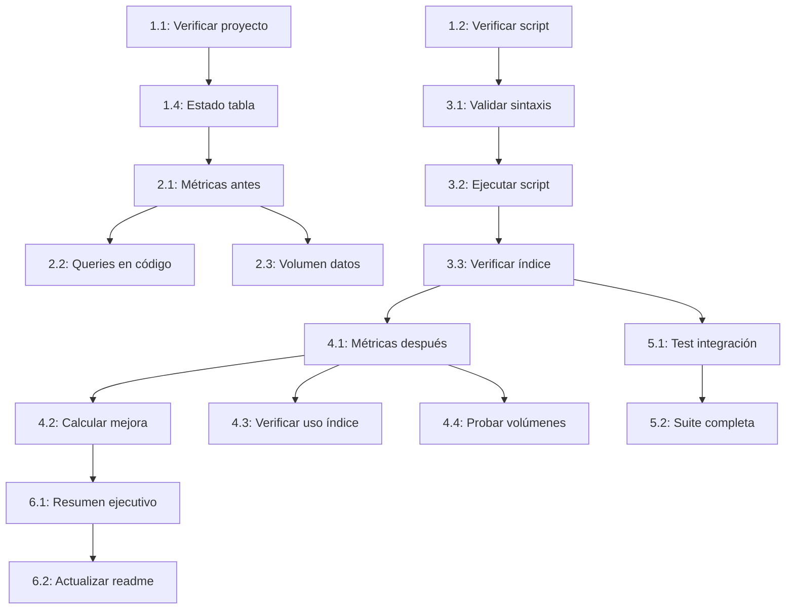

# Plan de Trabajo - Sprint: Optimización de Queries con Índices en Materials

## Resumen del Proyecto
Implementar y validar índices en la tabla `materials` para optimizar queries de listado por fecha de actualización. El sprint se enfoca en mejorar el rendimiento de consultas sin modificar lógica de negocio existente.

## Stack Tecnológico
- **Backend**: Go 1.23+ (Clean Architecture)
- **Base de Datos**: PostgreSQL 15+
- **Herramientas**: pgAdmin/psql para análisis de queries
- **Testing**: Testcontainers + EXPLAIN ANALYZE
- **Control de versiones**: Git (branch: `fix/debug-sprint-commands`)

---

## 📋 Plan de Ejecución

### Fase 1: Validación y Preparación del Entorno

**Objetivo**: Verificar el estado actual del proyecto y preparar el entorno para la implementación de índices.

**Tareas**:

- [ ] **1.1** - Verificar estado actual del proyecto
  - **Descripción**: Ejecutar `git status` y `go build ./...` para confirmar que no hay errores de compilación ni cambios pendientes no intencionados
  - **Archivos a verificar**: Todo el proyecto
  - **Criterio de aceptación**: Proyecto compila sin errores, git status muestra solo cambios esperados en `sprint/`
  - **Comando**:
    ```bash
    go build ./...
    git status
    ```

- [ ] **1.2** - Verificar existencia del script de migración
  - **Descripción**: Confirmar que el archivo `scripts/postgresql/06_indexes_materials.sql` existe y tiene el contenido correcto para crear índices
  - **Archivos a revisar**: `scripts/postgresql/06_indexes_materials.sql`
  - **Criterio de aceptación**: Archivo existe y contiene sentencias `CREATE INDEX` para `materials.updated_at`
  - **Comando**:
    ```bash
    cat scripts/postgresql/06_indexes_materials.sql
    ```

- [ ] **1.3** - Revisar configuración de base de datos
  - **Descripción**: Verificar que las variables de entorno de PostgreSQL están configuradas correctamente
  - **Archivos a revisar**: `.env`, `config/config.yaml`, `config/config-local.yaml`
  - **Criterio de aceptación**: Variables `POSTGRES_PASSWORD` y configuración de conexión están presentes

- [ ] **1.4** - Verificar estado actual de la tabla materials
  - **Descripción**: Consultar esquema actual de la tabla `materials` y verificar índices existentes
  - **Criterio de aceptación**: Conocer la estructura actual y confirmar que el índice en `updated_at` NO existe aún
  - **Comando SQL**:
    ```sql
    -- Conectar a base de datos y ejecutar:
    \d materials
    SELECT indexname, indexdef FROM pg_indexes WHERE tablename = 'materials';
    ```

**Completitud de Fase**: 0/4 tareas completadas

**¿Requiere Commit?**: ❌ No (solo validación)

---

### Fase 2: Análisis de Performance Antes de Índices

**Objetivo**: Establecer línea base de rendimiento actual antes de aplicar optimizaciones.

**Tareas**:

- [ ] **2.1** - Capturar métricas de query sin índice
  - **Descripción**: Ejecutar `EXPLAIN ANALYZE` en queries de listado de materials ordenados por `updated_at DESC` para medir tiempo de ejecución actual
  - **Archivos a crear**: `sprint/current/planning/metrics-before.md`
  - **Criterio de aceptación**: Documento con output completo de `EXPLAIN ANALYZE`, incluyendo planning time, execution time y tipo de scan utilizado
  - **Comando SQL**:
    ```sql
    EXPLAIN ANALYZE
    SELECT id, title, content_type, updated_at
    FROM materials
    ORDER BY updated_at DESC
    LIMIT 20;
    ```
  - 🔗 **Depende de**: Fase 1 - Tarea 1.4

- [ ] **2.2** - Identificar queries afectadas en el código
  - **Descripción**: Buscar en el código fuente todos los repositorios/handlers que ejecutan queries con `ORDER BY updated_at` en materials
  - **Archivos a revisar**: `internal/infrastructure/persistence/postgres/*`, `internal/infrastructure/http/handler/*`
  - **Criterio de aceptación**: Lista documentada en `metrics-before.md` de todas las funciones que se beneficiarán del índice
  - **Comando**:
    ```bash
    grep -r "ORDER BY.*updated_at" internal/infrastructure/persistence/
    ```

- [ ] **2.3** - Documentar volumen de datos actual
  - **Descripción**: Contar cantidad de registros en tabla `materials` para contextualizar el impacto esperado del índice
  - **Archivos a actualizar**: `sprint/current/planning/metrics-before.md`
  - **Criterio de aceptación**: Documento incluye `COUNT(*)` de materials y estimación de beneficio esperado
  - **Comando SQL**:
    ```sql
    SELECT COUNT(*) as total_materials FROM materials;
    SELECT pg_size_pretty(pg_total_relation_size('materials')) as table_size;
    ```

**Completitud de Fase**: 0/3 tareas completadas

**¿Requiere Commit?**: ✅ Sí (commit de documentación baseline)

**Mensaje de commit sugerido**:
```
docs: capturar métricas de performance antes de índices en materials

- Ejecutar EXPLAIN ANALYZE en queries principales
- Identificar queries afectadas en código
- Documentar volumen de datos actual (COUNT, table size)
- Establecer baseline para comparación post-índice

Archivos: sprint/current/planning/metrics-before.md

🤖 Generated with [Claude Code](https://claude.com/claude-code)

Co-Authored-By: Claude <noreply@anthropic.com>
```

---

### Fase 3: Aplicación de Índices en Base de Datos

**Objetivo**: Ejecutar el script de migración para crear el índice en `materials.updated_at`.

**Tareas**:

- [ ] **3.1** - Validar sintaxis del script SQL
  - **Descripción**: Revisar que el script `06_indexes_materials.sql` tiene sintaxis correcta y usa `CREATE INDEX IF NOT EXISTS` para idempotencia
  - **Archivos a revisar**: `scripts/postgresql/06_indexes_materials.sql`
  - **Criterio de aceptación**: Script contiene cláusula `IF NOT EXISTS` y está bien formateado
  - 🔗 **Depende de**: Fase 1 - Tarea 1.2

- [ ] **3.2** - Ejecutar script en base de datos local
  - **Descripción**: Aplicar el script de migración en ambiente local/dev
  - **Criterio de aceptación**: Script ejecuta sin errores, retorna mensaje de creación exitosa del índice
  - **Comando**:
    ```bash
    # Opción A: usando psql
    psql -h localhost -U <usuario> -d edugo_mobile -f scripts/postgresql/06_indexes_materials.sql

    # Opción B: desde aplicación Go (si hay comando make)
    make migrate
    ```
  - 🔗 **Depende de**: Tarea 3.1

- [ ] **3.3** - Verificar creación del índice
  - **Descripción**: Confirmar que el índice `idx_materials_updated_at` fue creado correctamente
  - **Criterio de aceptación**: Query a `pg_indexes` muestra el nuevo índice con definición correcta
  - **Comando SQL**:
    ```sql
    SELECT indexname, indexdef
    FROM pg_indexes
    WHERE tablename = 'materials' AND indexname = 'idx_materials_updated_at';

    -- Verificar tamaño del índice
    SELECT pg_size_pretty(pg_relation_size('idx_materials_updated_at')) as index_size;
    ```
  - 🔗 **Depende de**: Tarea 3.2

**Completitud de Fase**: 0/3 tareas completadas

**¿Requiere Commit?**: ✅ Sí (commit de migración ejecutada)

**Mensaje de commit sugerido**:
```
feat: aplicar índice en materials.updated_at para optimizar queries

- Ejecutar script scripts/postgresql/06_indexes_materials.sql
- Verificar creación exitosa de idx_materials_updated_at
- Documentar tamaño del índice creado

Migración: 06_indexes_materials.sql

🤖 Generated with [Claude Code](https://claude.com/claude-code)

Co-Authored-By: Claude <noreply@anthropic.com>
```

---

### Fase 4: Validación de Mejora de Performance

**Objetivo**: Medir el impacto del índice en el rendimiento de las queries y comparar con baseline.

**Tareas**:

- [ ] **4.1** - Capturar métricas de query con índice
  - **Descripción**: Re-ejecutar `EXPLAIN ANALYZE` en las mismas queries de la Fase 2 para medir mejora de rendimiento
  - **Archivos a crear**: `sprint/current/planning/metrics-after.md`
  - **Criterio de aceptación**: Documento con output de `EXPLAIN ANALYZE` mostrando uso del índice (Index Scan en lugar de Seq Scan)
  - **Comando SQL**:
    ```sql
    EXPLAIN ANALYZE
    SELECT id, title, content_type, updated_at
    FROM materials
    ORDER BY updated_at DESC
    LIMIT 20;
    ```
  - 🔗 **Depende de**: Fase 3 - Tarea 3.3

- [ ] **4.2** - Calcular mejora porcentual
  - **Descripción**: Comparar planning time y execution time antes/después, calcular % de mejora
  - **Archivos a actualizar**: `sprint/current/planning/metrics-after.md`
  - **Criterio de aceptación**: Documento incluye tabla comparativa con tiempos before/after y % de mejora
  - **Formato esperado**:
    ```markdown
    | Métrica          | Antes (ms) | Después (ms) | Mejora (%) |
    |------------------|------------|--------------|------------|
    | Planning Time    | X          | Y            | Z          |
    | Execution Time   | X          | Y            | Z          |
    | Total Time       | X          | Y            | Z          |
    ```
  - 🔗 **Depende de**: Tarea 4.1

- [ ] **4.3** - Verificar uso del índice en plan de ejecución
  - **Descripción**: Confirmar que el query planner está utilizando el índice `idx_materials_updated_at` y no hace Seq Scan
  - **Criterio de aceptación**: Output de `EXPLAIN` muestra "Index Scan using idx_materials_updated_at" o "Index Only Scan"
  - 🔗 **Depende de**: Tarea 4.1

- [ ] **4.4** - Probar con diferentes volúmenes de datos
  - **Descripción**: Ejecutar queries con diferentes `LIMIT` (20, 100, 1000) para validar que el índice es efectivo en todos los casos
  - **Archivos a actualizar**: `sprint/current/planning/metrics-after.md`
  - **Criterio de aceptación**: Documento incluye métricas para múltiples escenarios de LIMIT
  - 🔗 **Depende de**: Tarea 4.1

**Completitud de Fase**: 0/4 tareas completadas

**¿Requiere Commit?**: ✅ Sí (commit de validación de performance)

**Mensaje de commit sugerido**:
```
test: validar mejora de performance con índice en materials.updated_at

- Ejecutar EXPLAIN ANALYZE post-índice
- Calcular mejora porcentual en tiempos de ejecución
- Verificar uso efectivo del índice en query planner
- Probar diferentes volúmenes (LIMIT 20, 100, 1000)

Archivos: sprint/current/planning/metrics-after.md

🤖 Generated with [Claude Code](https://claude.com/claude-code)

Co-Authored-By: Claude <noreply@anthropic.com>
```

---

### Fase 5: Testing Automatizado (Opcional)

**Objetivo**: Crear tests automatizados que validen el comportamiento de las queries con el nuevo índice.

**Tareas**:

- [ ] **5.1** - Crear test de integración para query optimizado
  - **Descripción**: Escribir test en Go que ejecute la query de listado de materials y verifique que retorna resultados ordenados correctamente
  - **Archivos a crear**: `internal/infrastructure/persistence/postgres/material_repository_test.go` (si no existe) o agregar test
  - **Criterio de aceptación**: Test pasa exitosamente, valida orden DESC por `updated_at`
  - **Código esperado**:
    ```go
    func TestMaterialRepository_ListOrderedByUpdatedAt(t *testing.T) {
        // Setup testcontainer PostgreSQL
        // Ejecutar migración con índice
        // Insertar datos de prueba
        // Ejecutar query de listado
        // Assert: orden correcto, sin errores
    }
    ```
  - 🔗 **Depende de**: Fase 3 - Tarea 3.3

- [ ] **5.2** - Ejecutar suite completa de tests
  - **Descripción**: Correr todos los tests del proyecto para asegurar que el índice no rompió funcionalidad existente
  - **Criterio de aceptación**: `go test ./...` pasa al 100%
  - **Comando**:
    ```bash
    go test ./... -v -race -coverprofile=coverage.out
    ```
  - 🔗 **Depende de**: Tarea 5.1

**Completitud de Fase**: 0/2 tareas completadas

**¿Requiere Commit?**: ✅ Sí (si se crearon tests nuevos)

**Mensaje de commit sugerido**:
```
test: agregar tests de integración para query optimizado en materials

- Crear test que valida listado ordenado por updated_at DESC
- Verificar que índice no afecta funcionalidad existente
- Suite completa de tests pasa al 100%

Archivos: internal/infrastructure/persistence/postgres/material_repository_test.go

🤖 Generated with [Claude Code](https://claude.com/claude-code)

Co-Authored-By: Claude <noreply@anthropic.com>
```

---

### Fase 6: Documentación Final y Cleanup

**Objetivo**: Documentar el trabajo realizado, actualizar README del sprint y preparar para cierre.

**Tareas**:

- [ ] **6.1** - Crear resumen ejecutivo de la optimización
  - **Descripción**: Escribir documento que resuma el antes/después, beneficios obtenidos y recomendaciones
  - **Archivos a crear**: `sprint/current/planning/summary.md`
  - **Criterio de aceptación**: Documento incluye:
    - Objetivo del sprint
    - Índice creado (nombre, columna, tipo)
    - Mejora de performance (%)
    - Queries afectadas
    - Recomendaciones para otros índices futuros
  - 🔗 **Depende de**: Fase 4 - Tarea 4.2

- [ ] **6.2** - Actualizar sprint/current/readme.md
  - **Descripción**: Marcar todas las casillas del plan original como completadas, agregar enlace a documentación de métricas
  - **Archivos a actualizar**: `sprint/current/readme.md`
  - **Criterio de aceptación**: Archivo actualizado con ✅ en todas las tareas, sección "Resultados" agregada
  - 🔗 **Depende de**: Tarea 6.1

- [ ] **6.3** - Verificar que no hay TODOs pendientes relacionados
  - **Descripción**: Buscar en el código si hay comentarios `// TODO` relacionados con optimización de materials
  - **Criterio de aceptación**: No hay TODOs pendientes o están documentados para futuros sprints
  - **Comando**:
    ```bash
    grep -r "TODO.*material.*performance\|TODO.*index.*material" internal/
    ```

- [ ] **6.4** - Actualizar CHANGELOG (si existe)
  - **Descripción**: Agregar entrada en CHANGELOG.md sobre la optimización implementada
  - **Archivos a actualizar**: `CHANGELOG.md`
  - **Criterio de aceptación**: Entrada agregada bajo sección "Optimizations" o "Performance"
  - **Formato esperado**:
    ```markdown
    ### Performance
    - Agregar índice en `materials.updated_at` para optimizar queries de listado (mejora del X%)
    ```

**Completitud de Fase**: 0/4 tareas completadas

**¿Requiere Commit?**: ✅ Sí (commit de documentación final)

**Mensaje de commit sugerido**:
```
docs: documentar optimización de índices en materials - cierre de sprint

- Crear resumen ejecutivo con métricas before/after
- Actualizar sprint/current/readme.md con status completado
- Verificar TODOs pendientes
- Actualizar CHANGELOG con optimización implementada

Sprint completado: índice en materials.updated_at con mejora del X%

🤖 Generated with [Claude Code](https://claude.com/claude-code)

Co-Authored-By: Claude <noreply@anthropic.com>
```

---

## 📊 Resumen de Dependencias

### Grafo de Dependencias


### Ruta Crítica
Las siguientes tareas están en la ruta crítica y deben completarse en orden:
1. Tarea 1.2 → Tarea 3.1 → Tarea 3.2 → Tarea 3.3 → Tarea 4.1 → Tarea 4.2 → Tarea 6.1 → Tarea 6.2

### Tareas Independientes
Estas tareas pueden ejecutarse en paralelo (no hay dependencias entre ellas):
- Fase 1: Tarea 1.1, 1.3 (pueden hacerse simultáneamente)
- Fase 2: Tarea 2.2 y 2.3 (después de 2.1)
- Fase 4: Tarea 4.3 y 4.4 (después de 4.1)
- Fase 5: Puede hacerse en paralelo con Fase 4 si se desea

---

## 📈 Métricas del Plan

- **Total de fases**: 6 (5 obligatorias + 1 opcional)
- **Total de tareas**: 20
- **Tareas con dependencias**: 14
- **Tareas independientes**: 6
- **Commits recomendados**: 5 (uno por fase 2-6)
- **Estimación**: 2-4 horas (dependiendo de volumen de datos y testing)

---

## 🎯 Estrategia de Ejecución Recomendada

1. **Primera iteración**: Completar Fase 1 y Fase 2 (validación + baseline) - ~30 min
2. **Segunda iteración**: Ejecutar Fase 3 (aplicar índice) - ~15 min
3. **Tercera iteración**: Completar Fase 4 (validación de mejora) - ~30 min
4. **Cuarta iteración** (opcional): Fase 5 (testing automatizado) - ~1 hora
5. **Quinta iteración**: Fase 6 (documentación final) - ~30 min

**Nota**: Usa `/03-execution phase-1` para ejecutar fases específicas.

---

## 🔄 Plan de Rollback

En caso de que el índice cause problemas inesperados:

### Script de Rollback
```sql
-- Eliminar el índice creado
DROP INDEX IF EXISTS idx_materials_updated_at;

-- Verificar eliminación
SELECT indexname FROM pg_indexes WHERE tablename = 'materials';
```

### Pasos de Rollback
1. Ejecutar script de rollback en base de datos
2. Verificar que query planner vuelve a usar Seq Scan
3. Revertir commits con `git revert <commit-hash>` (NO usar reset)
4. Documentar razón del rollback en `sprint/current/planning/rollback.md`

### Señales de Alerta para Rollback
- Queries se vuelven más lentas en lugar de más rápidas
- Errores en aplicación relacionados con ordenamiento
- Índice consume espacio excesivo (>10% del tamaño de la tabla)
- Tests empiezan a fallar después de aplicar índice

---

## 📝 Notas Adicionales

### Consideraciones Importantes

1. **Tamaño del Índice**: Los índices en columnas de tipo timestamp son generalmente pequeños y eficientes. Se espera que el índice ocupe ~5-10% del tamaño de la tabla.

2. **Impacto en Escritura**: Los `INSERT` y `UPDATE` en la tabla `materials` serán ligeramente más lentos (microsegundos) debido a la actualización del índice. Este overhead es despreciable comparado con la mejora en lecturas.

3. **Mantenimiento Automático**: PostgreSQL mantiene los índices automáticamente con `VACUUM` y `ANALYZE`. No se requiere mantenimiento manual.

4. **Índices Compuestos Futuros**: Si en el futuro se necesita filtrar por `content_type` + ordenar por `updated_at`, considerar crear índice compuesto:
   ```sql
   CREATE INDEX idx_materials_content_type_updated_at
   ON materials(content_type, updated_at DESC);
   ```

5. **Monitoreo Post-Deploy**: En ambientes de producción, monitorear el tamaño del índice y el uso con:
   ```sql
   SELECT
       schemaname,
       tablename,
       indexname,
       idx_scan as index_scans,
       idx_tup_read as tuples_read,
       idx_tup_fetch as tuples_fetched
   FROM pg_stat_user_indexes
   WHERE indexname = 'idx_materials_updated_at';
   ```

### Comandos Útiles de Diagnóstico

```bash
# Verificar índices en toda la base de datos
psql -c "SELECT schemaname, tablename, indexname FROM pg_indexes WHERE schemaname = 'public';"

# Ver estadísticas de uso de índices
psql -c "SELECT * FROM pg_stat_user_indexes WHERE indexname LIKE '%materials%';"

# Verificar tamaño de todos los índices de materials
psql -c "SELECT indexname, pg_size_pretty(pg_relation_size(indexname::regclass)) FROM pg_indexes WHERE tablename = 'materials';"
```

### Referencias
- PostgreSQL Index Documentation: https://www.postgresql.org/docs/current/indexes.html
- EXPLAIN ANALYZE Guide: https://www.postgresql.org/docs/current/using-explain.html
- Best Practices for Indexing: https://www.postgresql.org/docs/current/indexes-types.html

---

**🎯 ¡Plan listo para ejecutar!**

Usa el comando `/03-execution phase-N` para ejecutar cada fase de forma independiente, o `/03-execution` para ejecutar todo el plan completo.

---

**Generado por**: Agente de Planificación (02-planning)
**Fecha**: 2025-11-04
**Sprint**: fix/debug-sprint-commands
**Versión del Plan**: 1.0
