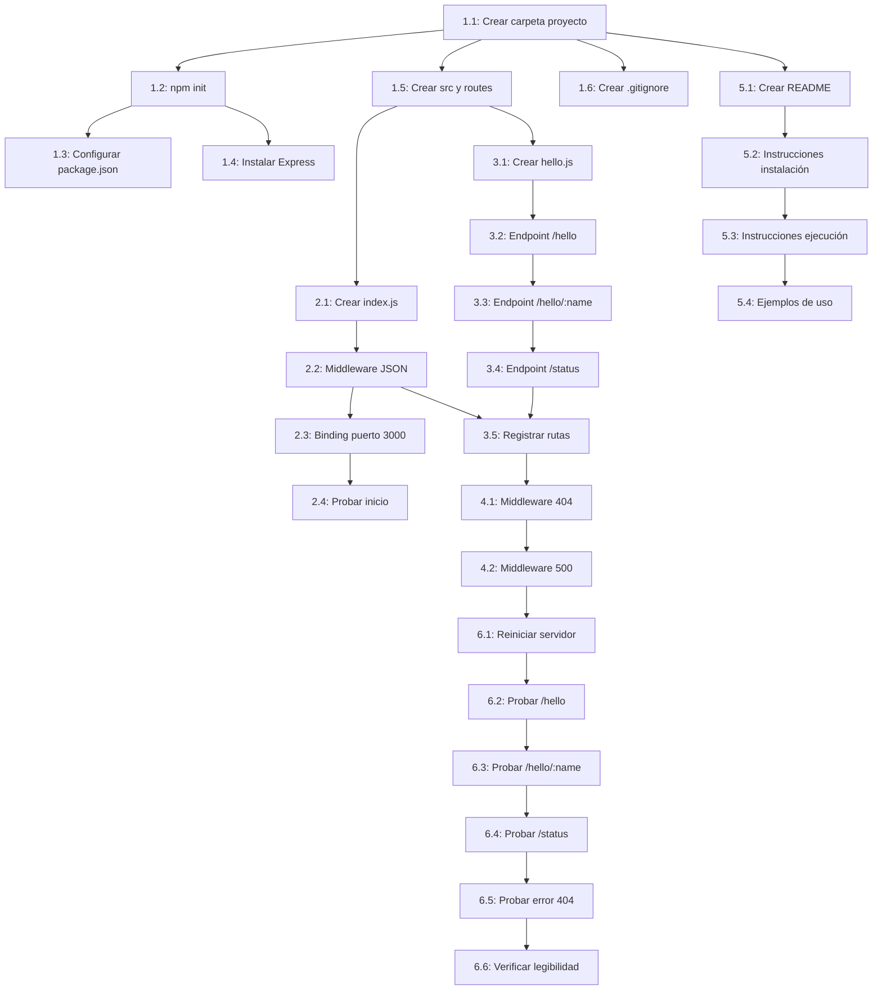

# Plan de Trabajo - API REST de Saludos (Prueba Rápida)

## Resumen del Proyecto

Implementar una API REST minimalista con Node.js y Express.js que exponga tres endpoints de saludo (`/api/hello`, `/api/hello/:name`, `/api/status`) para validar el flujo completo del sistema de desarrollo. El proyecto prioriza simplicidad y rapidez de implementación.

## Stack Tecnológico

- **Backend**: Node.js v18+ (LTS) con Express.js v4.18+
- **Runtime**: Node.js (sin contenedores ni virtualización)
- **Parser**: express.json() middleware (integrado)
- **Gestión de dependencias**: npm
- **Base de datos**: No aplica (sin persistencia)

---

## 📋 Plan de Ejecución

### Fase 1: Configuración Inicial del Proyecto

**Objetivo**: Crear la estructura base del proyecto Node.js con las dependencias necesarias y la organización de carpetas.

**Tareas**:

- [ ] **1.1** - Crear carpeta del proyecto
  - **Descripción**: Crear directorio `proyecto/` en la raíz del repositorio
  - **Archivos a crear/modificar**: Crear carpeta `proyecto/`
  - **Criterio de aceptación**: Carpeta `proyecto/` existe en el sistema de archivos

- [ ] **1.2** - Inicializar proyecto npm
  - **Descripción**: Ejecutar `npm init -y` dentro de la carpeta `proyecto/` para generar `package.json`
  - **Archivos a crear/modificar**: `proyecto/package.json`
  - **Criterio de aceptación**: Archivo `package.json` existe con configuración básica (name, version, main, scripts)
  - 🔗 **Depende de**: Tarea 1.1

- [ ] **1.3** - Configurar información del package.json
  - **Descripción**: Editar `package.json` para agregar nombre descriptivo, descripción, y script de inicio
  - **Archivos a crear/modificar**: `proyecto/package.json`
  - **Criterio de aceptación**:
    - Campo `name` = "api-rest-saludos"
    - Campo `description` = "API REST minimalista de saludos"
    - Script `start` = "node src/index.js"
  - 🔗 **Depende de**: Tarea 1.2

- [ ] **1.4** - Instalar Express.js como dependencia
  - **Descripción**: Ejecutar `npm install express` en la carpeta del proyecto
  - **Archivos a crear/modificar**:
    - `proyecto/package.json` (actualiza dependencies)
    - `proyecto/package-lock.json` (se genera automáticamente)
    - `proyecto/node_modules/` (se crea automáticamente)
  - **Criterio de aceptación**: Express.js aparece en `dependencies` del `package.json` con versión >= 4.18.0
  - 🔗 **Depende de**: Tarea 1.2

- [ ] **1.5** - Crear estructura de carpetas
  - **Descripción**: Crear las carpetas `src/` y `src/routes/` dentro de `proyecto/`
  - **Archivos a crear/modificar**:
    - Crear carpeta `proyecto/src/`
    - Crear carpeta `proyecto/src/routes/`
  - **Criterio de aceptación**: Ambas carpetas existen en la estructura del proyecto
  - 🔗 **Depende de**: Tarea 1.1

- [ ] **1.6** - Crear archivo .gitignore
  - **Descripción**: Crear archivo `.gitignore` para excluir `node_modules/` y otros archivos temporales
  - **Archivos a crear/modificar**: `proyecto/.gitignore`
  - **Criterio de aceptación**: Archivo `.gitignore` contiene al menos:
    ```
    node_modules/
    .env
    *.log
    ```
  - 🔗 **Depende de**: Tarea 1.1

**Completitud de la Fase**: 0/6 tareas completadas

---

### Fase 2: Implementación del Servidor Express

**Objetivo**: Crear el archivo principal del servidor Express con configuración básica de middleware y binding del puerto.

**Tareas**:

- [ ] **2.1** - Crear archivo src/index.js (esqueleto)
  - **Descripción**: Crear el archivo principal con importación de Express y estructura básica
  - **Archivos a crear/modificar**: `proyecto/src/index.js`
  - **Criterio de aceptación**: Archivo contiene:
    - `const express = require('express');`
    - `const app = express();`
    - Definición de constante `PORT = 3000`
  - 🔗 **Depende de**: Fase 1 - Tarea 1.5

- [ ] **2.2** - Configurar middleware JSON parser
  - **Descripción**: Agregar middleware `express.json()` para parsear peticiones JSON
  - **Archivos a crear/modificar**: `proyecto/src/index.js`
  - **Criterio de aceptación**: Código incluye `app.use(express.json());`
  - 🔗 **Depende de**: Tarea 2.1

- [ ] **2.3** - Implementar binding del servidor al puerto 3000
  - **Descripción**: Agregar código `app.listen()` para iniciar el servidor
  - **Archivos a crear/modificar**: `proyecto/src/index.js`
  - **Criterio de aceptación**: Código incluye:
    ```javascript
    app.listen(PORT, () => {
      console.log(`Servidor escuchando en http://localhost:${PORT}`);
    });
    ```
  - 🔗 **Depende de**: Tarea 2.2

- [ ] **2.4** - Probar inicio del servidor (validación temprana)
  - **Descripción**: Ejecutar `npm start` para verificar que el servidor inicia sin errores
  - **Archivos a crear/modificar**: Ninguno (solo prueba)
  - **Criterio de aceptación**:
    - Servidor inicia sin errores
    - Mensaje "Servidor escuchando en http://localhost:3000" aparece en consola
    - Servidor responde en el puerto 3000 (aunque sin rutas aún)
  - 🔗 **Depende de**: Tarea 2.3

**Completitud de la Fase**: 0/4 tareas completadas

---

### Fase 3: Implementación de Rutas y Endpoints

**Objetivo**: Crear el módulo de rutas con los tres endpoints requeridos (`/api/hello`, `/api/hello/:name`, `/api/status`).

**Tareas**:

- [ ] **3.1** - Crear archivo src/routes/hello.js (esqueleto)
  - **Descripción**: Crear archivo de rutas con importación de Express Router
  - **Archivos a crear/modificar**: `proyecto/src/routes/hello.js`
  - **Criterio de aceptación**: Archivo contiene:
    ```javascript
    const express = require('express');
    const router = express.Router();

    // Rutas se agregarán aquí

    module.exports = router;
    ```
  - 🔗 **Depende de**: Fase 1 - Tarea 1.5

- [ ] **3.2** - Implementar endpoint GET /api/hello (saludo genérico)
  - **Descripción**: Agregar ruta que retorna `{ "message": "Hello, World!" }`
  - **Archivos a crear/modificar**: `proyecto/src/routes/hello.js`
  - **Criterio de aceptación**: Código incluye:
    ```javascript
    router.get('/hello', (req, res) => {
      res.json({ message: 'Hello, World!' });
    });
    ```
  - 🔗 **Depende de**: Tarea 3.1

- [ ] **3.3** - Implementar endpoint GET /api/hello/:name (saludo personalizado)
  - **Descripción**: Agregar ruta con parámetro dinámico que retorna `{ "message": "Hello, {name}!" }`
  - **Archivos a crear/modificar**: `proyecto/src/routes/hello.js`
  - **Criterio de aceptación**: Código incluye:
    ```javascript
    router.get('/hello/:name', (req, res) => {
      const { name } = req.params;
      res.json({ message: `Hello, ${name}!` });
    });
    ```
  - 🔗 **Depende de**: Tarea 3.2

- [ ] **3.4** - Implementar endpoint GET /api/status (estado del servidor)
  - **Descripción**: Agregar ruta que retorna `{ "status": "ok", "timestamp": "..." }`
  - **Archivos a crear/modificar**: `proyecto/src/routes/hello.js`
  - **Criterio de aceptación**: Código incluye:
    ```javascript
    router.get('/status', (req, res) => {
      res.json({
        status: 'ok',
        timestamp: new Date().toISOString()
      });
    });
    ```
  - 🔗 **Depende de**: Tarea 3.3

- [ ] **3.5** - Registrar rutas en el servidor principal
  - **Descripción**: Importar y registrar el router en `src/index.js` bajo el prefijo `/api`
  - **Archivos a crear/modificar**: `proyecto/src/index.js`
  - **Criterio de aceptación**: Código incluye:
    ```javascript
    const helloRoutes = require('./routes/hello');
    app.use('/api', helloRoutes);
    ```
  - 🔗 **Depende de**: Tarea 3.4 y Fase 2 - Tarea 2.2

**Completitud de la Fase**: 0/5 tareas completadas

---

### Fase 4: Manejo de Errores

**Objetivo**: Implementar middleware de manejo de errores para rutas no encontradas y errores del servidor.

**Tareas**:

- [ ] **4.1** - Implementar manejador de rutas no encontradas (404)
  - **Descripción**: Agregar middleware para capturar peticiones a rutas inexistentes
  - **Archivos a crear/modificar**: `proyecto/src/index.js`
  - **Criterio de aceptación**: Código incluye (después del registro de rutas):
    ```javascript
    app.use((req, res, next) => {
      res.status(404).json({
        error: 'Not Found',
        message: 'La ruta solicitada no existe'
      });
    });
    ```
  - 🔗 **Depende de**: Fase 3 - Tarea 3.5

- [ ] **4.2** - Implementar manejador de errores del servidor (500)
  - **Descripción**: Agregar middleware de error para capturar excepciones no manejadas
  - **Archivos a crear/modificar**: `proyecto/src/index.js`
  - **Criterio de aceptación**: Código incluye (al final, después del middleware 404):
    ```javascript
    app.use((err, req, res, next) => {
      console.error('Error:', err);
      res.status(500).json({
        error: 'Internal Server Error',
        message: 'Ocurrió un error en el servidor'
      });
    });
    ```
  - 🔗 **Depende de**: Tarea 4.1

**Completitud de la Fase**: 0/2 tareas completadas

---

### Fase 5: Documentación

**Objetivo**: Crear documentación clara con instrucciones de instalación, ejecución y ejemplos de uso.

**Tareas**:

- [ ] **5.1** - Crear archivo README.md del proyecto
  - **Descripción**: Crear README con descripción del proyecto, requisitos y estructura
  - **Archivos a crear/modificar**: `proyecto/README.md`
  - **Criterio de aceptación**: Archivo incluye secciones:
    - Título: "API REST de Saludos"
    - Descripción del proyecto
    - Requisitos previos (Node.js v18+)
    - Estructura de carpetas
  - 🔗 **Depende de**: Fase 1 - Tarea 1.1

- [ ] **5.2** - Agregar instrucciones de instalación al README
  - **Descripción**: Documentar los pasos para instalar dependencias
  - **Archivos a crear/modificar**: `proyecto/README.md`
  - **Criterio de aceptación**: README incluye sección "Instalación" con:
    ```bash
    cd proyecto
    npm install
    ```
  - 🔗 **Depende de**: Tarea 5.1

- [ ] **5.3** - Agregar instrucciones de ejecución al README
  - **Descripción**: Documentar cómo iniciar el servidor
  - **Archivos a crear/modificar**: `proyecto/README.md`
  - **Criterio de aceptación**: README incluye sección "Ejecución" con:
    ```bash
    npm start
    ```
    Y nota indicando que el servidor estará disponible en `http://localhost:3000`
  - 🔗 **Depende de**: Tarea 5.2

- [ ] **5.4** - Documentar ejemplos de uso de los endpoints
  - **Descripción**: Agregar ejemplos de curl para cada endpoint
  - **Archivos a crear/modificar**: `proyecto/README.md`
  - **Criterio de aceptación**: README incluye sección "Endpoints" con ejemplos:
    ```bash
    # Saludo genérico
    curl http://localhost:3000/api/hello

    # Saludo personalizado
    curl http://localhost:3000/api/hello/Juan

    # Estado del servidor
    curl http://localhost:3000/api/status
    ```
    Y las respuestas esperadas para cada uno
  - 🔗 **Depende de**: Tarea 5.3

**Completitud de la Fase**: 0/4 tareas completadas

---

### Fase 6: Validación y Pruebas

**Objetivo**: Verificar que todos los endpoints funcionan correctamente y cumplen con los criterios de aceptación.

**Tareas**:

- [ ] **6.1** - Reiniciar servidor y verificar inicio sin errores
  - **Descripción**: Detener cualquier instancia previa, ejecutar `npm start` y verificar mensaje de confirmación
  - **Archivos a crear/modificar**: Ninguno (solo prueba)
  - **Criterio de aceptación**:
    - Servidor inicia en menos de 3 segundos
    - Mensaje de confirmación aparece en consola
    - No hay errores en el log
  - 🔗 **Depende de**: Fase 4 - Tarea 4.2

- [ ] **6.2** - Probar endpoint GET /api/hello
  - **Descripción**: Ejecutar `curl http://localhost:3000/api/hello` y verificar respuesta
  - **Archivos a crear/modificar**: Ninguno (solo prueba)
  - **Criterio de aceptación**:
    - Código HTTP 200
    - Respuesta JSON: `{ "message": "Hello, World!" }`
    - Tiempo de respuesta < 100ms
  - 🔗 **Depende de**: Tarea 6.1

- [ ] **6.3** - Probar endpoint GET /api/hello/:name con diferentes nombres
  - **Descripción**: Probar con "Juan", "Maria", "Carlos", "Ana", y "世界" (Unicode)
  - **Archivos a crear/modificar**: Ninguno (solo prueba)
  - **Criterio de aceptación**:
    - Todos retornan código HTTP 200
    - Respuesta JSON correcta para cada nombre: `{ "message": "Hello, {name}!" }`
    - Caracteres Unicode se manejan correctamente
    - Tiempo de respuesta < 100ms por petición
  - 🔗 **Depende de**: Tarea 6.2

- [ ] **6.4** - Probar endpoint GET /api/status
  - **Descripción**: Ejecutar `curl http://localhost:3000/api/status` y verificar respuesta
  - **Archivos a crear/modificar**: Ninguno (solo prueba)
  - **Criterio de aceptación**:
    - Código HTTP 200
    - Respuesta JSON con estructura: `{ "status": "ok", "timestamp": "..." }`
    - Timestamp en formato ISO 8601 válido
    - Tiempo de respuesta < 100ms
  - 🔗 **Depende de**: Tarea 6.3

- [ ] **6.5** - Probar manejo de errores (ruta no encontrada)
  - **Descripción**: Ejecutar `curl http://localhost:3000/api/xyz` para verificar error 404
  - **Archivos a crear/modificar**: Ninguno (solo prueba)
  - **Criterio de aceptación**:
    - Código HTTP 404
    - Respuesta JSON con estructura de error: `{ "error": "Not Found", "message": "..." }`
  - 🔗 **Depende de**: Tarea 6.4

- [ ] **6.6** - Verificar formato del código (legibilidad)
  - **Descripción**: Revisar que el código es limpio, bien indentado y fácil de entender
  - **Archivos a crear/modificar**: Ninguno (solo revisión)
  - **Criterio de aceptación**:
    - Código usa indentación consistente (2 espacios)
    - Variables tienen nombres descriptivos
    - No hay código comentado sin usar
    - Estructura es clara y sigue las mejores prácticas de Node.js
  - 🔗 **Depende de**: Tarea 6.5

**Completitud de la Fase**: 0/6 tareas completadas

---

## 📊 Resumen de Dependencias

### Grafo de Dependencias



### Camino Crítico

Las siguientes tareas están en el camino crítico y deben completarse en orden:

1. **1.1** → **1.2** → **1.5** → **2.1** → **2.2** → **2.3** → **3.1** → **3.2** → **3.3** → **3.4** → **3.5** → **4.1** → **4.2** → **6.1** → **6.2** → **6.3** → **6.4** → **6.5** → **6.6**

### Tareas Independientes (Pueden Ejecutarse en Paralelo)

Estas tareas NO tienen dependencias entre sí y pueden ejecutarse simultáneamente:

- **Grupo A** (después de 1.1):
  - Tarea 1.6 (Crear .gitignore)
  - Tarea 5.1 (Crear README inicial)

- **Grupo B** (después de 1.2):
  - Tarea 1.3 (Configurar package.json)
  - Tarea 1.4 (Instalar Express)

- **Documentación** (Fase 5 puede hacerse en paralelo con desarrollo después de 1.1)

---

## 📈 Métricas del Plan

- **Total de fases**: 6
- **Total de tareas**: 27
- **Tareas con dependencias**: 25
- **Tareas independientes**: 2 (1.6 y 5.1 inicialmente)
- **Estimación de tiempo**: 25-40 minutos (5-10 minutos por fase, considerando que algunas tareas son muy rápidas)

### Distribución de Tareas por Fase

| Fase | Nombre | Tareas | Tipo de Trabajo |
|------|--------|--------|-----------------|
| 1 | Configuración Inicial | 6 | Setup de infraestructura |
| 2 | Servidor Express | 4 | Implementación core |
| 3 | Rutas y Endpoints | 5 | Implementación de funcionalidad |
| 4 | Manejo de Errores | 2 | Robustez y calidad |
| 5 | Documentación | 4 | Documentación técnica |
| 6 | Validación y Pruebas | 6 | QA y verificación |

---

## 🎯 Estrategia de Ejecución Recomendada

### Opción 1: Ejecución Completa (Recomendada para validación)
```bash
/03-ejecucion
```
Ejecuta todo el plan de principio a fin en una sola sesión.

### Opción 2: Ejecución por Fases
```bash
/03-ejecucion fase-1  # Configuración inicial
/03-ejecucion fase-2  # Servidor Express
/03-ejecucion fase-3  # Endpoints
/03-ejecucion fase-4  # Errores
/03-ejecucion fase-5  # Documentación
/03-ejecucion fase-6  # Validación
```

### Opción 3: Enfoque Iterativo (Desarrollo ágil)

**Primera Iteración** - MVP Funcional:
- Fase 1 (Configuración)
- Fase 2 (Servidor básico)
- Fase 3 (Endpoints core)
- Prueba rápida manual con curl

**Segunda Iteración** - Robustez:
- Fase 4 (Manejo de errores)
- Fase 6 (Validación completa)

**Tercera Iteración** - Documentación:
- Fase 5 (README y documentación)

### Orden Recomendado para Primera Ejecución

1. **Completar Fase 1 completa** (configuración base) - ~5 minutos
2. **Completar Fase 2 completa** (servidor funcionando) - ~5 minutos
3. **Completar Fase 3 completa** (funcionalidad core) - ~8 minutos
4. **Prueba manual rápida** con curl para validar endpoints - ~2 minutos
5. **Completar Fase 4** (manejo de errores) - ~3 minutos
6. **Completar Fase 5** (documentación) - ~5 minutos
7. **Completar Fase 6** (validación exhaustiva) - ~7 minutos

**Tiempo total estimado**: 35 minutos

---

## 📝 Notas Adicionales

### Consideraciones Importantes

1. **Sin Commits Automáticos Durante Desarrollo**
   - Según instrucciones globales, los commits solo se hacen al final si el proyecto no tiene errores
   - Si se desea hacer commits atómicos por fase, solicitar autorización explícita del usuario

2. **Validación Temprana**
   - La tarea 2.4 (probar inicio del servidor) permite detectar problemas de configuración antes de continuar
   - Recomendado ejecutarla aunque el servidor aún no tenga rutas

3. **Pruebas de Endpoints**
   - La Fase 6 puede ejecutarse parcialmente después de cada endpoint implementado
   - No es necesario esperar a tener todo implementado para hacer validaciones

4. **Manejo de Unicode**
   - El endpoint `/api/hello/:name` debe soportar caracteres Unicode (ej: 世界)
   - Express maneja esto automáticamente, pero debe validarse en las pruebas

5. **Performance**
   - Los objetivos son: respuesta < 100ms, inicio < 3 segundos
   - Con esta arquitectura simple, estos objetivos se cumplen fácilmente
   - Solo validar en la Fase 6

6. **Extensibilidad**
   - Aunque el alcance es minimalista, el código debe ser limpio y extensible
   - Facilita agregar más endpoints en el futuro si se requiere

### Warnings

⚠️ **No implementar** características fuera del alcance:
- Base de datos o persistencia
- Autenticación o autorización
- Tests automatizados (solo pruebas manuales)
- Logging estructurado (solo console.log básico)
- Configuración de entornos (todo hardcoded para desarrollo)

⚠️ **Verificar Node.js instalado**:
- Antes de iniciar, confirmar que Node.js v18+ está instalado
- Ejecutar: `node --version`

⚠️ **Puerto 3000 disponible**:
- Asegurarse de que el puerto 3000 no esté en uso por otro proceso
- Si está ocupado, detener el proceso o cambiar el puerto

### Próximos Pasos Después de Completar el Plan

Una vez completadas todas las fases:

1. **Ejecutar `/04-revision`** para revisión de código y calidad
2. **Crear commit** (si el usuario lo aprueba y no hay errores)
3. **Documentar aprendizajes** sobre el flujo de comandos/agentes
4. **Opcionalmente**: Migrar a `Sprint/readme.futuro.md` para un proyecto más completo

---

**Fecha de planificación**: 2025-10-31
**Versión de documento**: 1.0
**Estado**: ✅ Plan listo para ejecución
